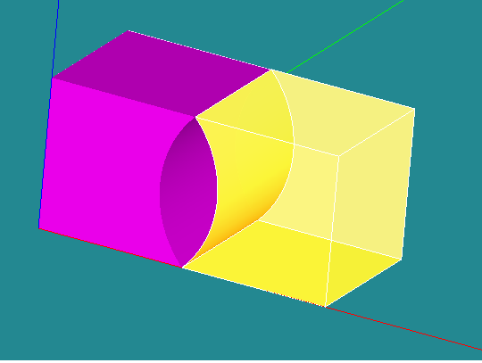
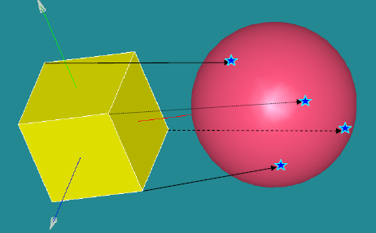
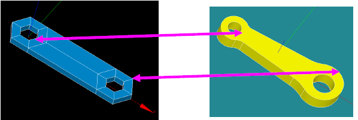
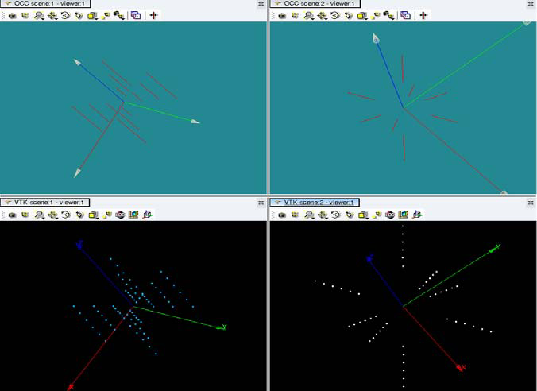

:tocdepth: 3

.. _blockmethod:

===============================
Principle: the method by blocks
===============================

A block is a volume defined by:

- 8 vertices
- 12 edges
	- *straight line*, *curve*
- 6 quadrangular faces
	- *planar face*, *3D face*

A compound of blocks is a volume that for each face is:

- either a free face (in one block)
- or a face shared between 2 blocks

The method by blocks consists in:

- finding a coumpound of blocks
- this coumpound of blocks has to be equivalent to the initial geometry to mesh.

Applicative choices
===================
Finding a coumpound of blocks is in charge of users.
 
Hexablock enables to define a mesh with hexahedra in five stages:

	1. Load and create a geometry without constraint
	2. Search a compound of blocks (mental working)
	3. Create a model of blocks
	4. Associate this model of blocks to the geometry
	5. Generate the mesh

- Two ways of working:

	- *Graphic User Interface*
	- *Python Scripting*

.. _modelbloc:

Create a model of blocks
========================

A model of block is a compound of blocks based on a topological definition. The model of blocks construction can be build by using the two following methods:

1. Construct and associate blocks (hexahedra)
	- the main operations for creating blocks are:
		- Basics: create, remove,transform
		- construct hexahedra grids: cartesian, cylindrical, spherical
		
	- blocks association operations:
		- merge, cut, disconnect hexahedra 
		- prism, join quadrangles
		- merge two quadrangles of two blocks
		- merge two edges
		- merge two vertices
		- disconnect two vertices
		- create hexahedra between two existing quadrangles

2. Construct hexahedras via predifined models:
	- cylinder
	- pipe
	- two intersected cylinders
	- two intersected pipes

Examples of simple models of blocks:
-------------------------------------

.. image:: _static/ex1.PNG
   :align: center

.. centered::
   2 blocks linked by 1 face

.. centered::
   2 blocks linked by 2 edges

.. _assomodelgeo:

Associate a model of blocks to a geometry
==========================================
Associate the model to the geometry means that the geometry to mesh is "raw" for this application. In other words, there will be no modification of this geometry end no rebuild of a complete new geometry.
However it is possible to complete this geometry by adding new pieces if neccessary without any topological operation to link these pieces to the initial geometry.
Generally, the geometry to mesh is defined as a set of faces, if these faces are not given under solid form but form logically this solid, it iis sufficient for this application.

To associate the model to the geometry, three succesives steps are to be followed:

1. Mandatory: associate **all the vertices** of the model to the geometry
2. If necessary: associate **the needed edges** of the model to the geometry
3. If necessary: associate **the needed faces** of the model to the geometry

.. centered::
   Partial association of the model (yellow block) with a geometry (sphere) where the blue stars are points taken on the sphere et the black arrows show the association of model vertices with these points.

.. centered::
   Rod connecting

.. generatemesh:

Generate the mesh
=================
Once the model and its association to the geometry created, the hexahedral mesh can be generated by mentionning:

- the discretization of the edges thanks to discretization laws
- the potential groups

To discretize, the application proceeds in three steps:

- the application computes a partition of the model edges, where each sub-set of edges corresponds to the edges related to the propagation,
- the user defines the needed dicretization laws, a law is characterized by:
	* the name of this law,
	* the number of nodes to compute
	* a repartition (uniform, arithmetic, etc.)
- the user (working on the model) apply a discretization law on each sub-set of propagation edges

The groups are defined on the model of blocks and the main types of groups are:

- groups of hexahedra
- groups of quadrangles
- groups of edges
- groups of nodes

.. centered::
   Example of propagation-linked edges sub-set 

