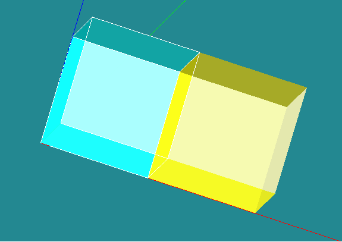

:tocdepth: 3

.. _blockmethod:

===============================
Principle: the method by blocks
===============================

Principle
=========

The principle of the method by block is to decompose the geometry to
be meshed into a set of hexaedra related per face. The initial
geometry is divided into a new geometry which has the property to be a
set solids. All these solids are hexaedra with shared faces. Once
cutting is complete, the mesh is easy to obtain.

The method by blocks consists in:

- finding a coumpound of blocks
- this coumpound of blocks has to be equivalent to the initial geometry to mesh.

A block is a volume defined by:

- 8 vertices
- 12 edges
	- *straight line*, *curve*
- 6 quadrangular faces
	- *planar face*, *3D face*

A compound of blocks is a volume that for each face is:

- either a free face (in one block)
- or a face shared between 2 blocks

.. _modelbloc:

Create a model of blocks
========================

A model of block is a compound of blocks based on a topological
definition. The model of blocks construction can be build by using the
two following methods:

1. Construct and associate blocks (hexahedra)
	- the main operations for creating blocks are:
		- Basics: create, remove,transform
		- construct hexahedra grids: cartesian, cylindrical, spherical
		
	- blocks association operations:
		- merge, cut, disconnect hexahedra 
		- prism, join quadrangles
		- merge two quadrangles of two blocks
		- merge two edges
		- merge two vertices
		- disconnect two vertices
		- create hexahedra between two existing quadrangles

2. Construct hexahedras via predifined models:
	- cylinder
	- pipe
	- two intersected cylinders
	- two intersected pipes

Example of simple model of blocks
=================================

.. centered::
   2 blocks linked by 1 face

