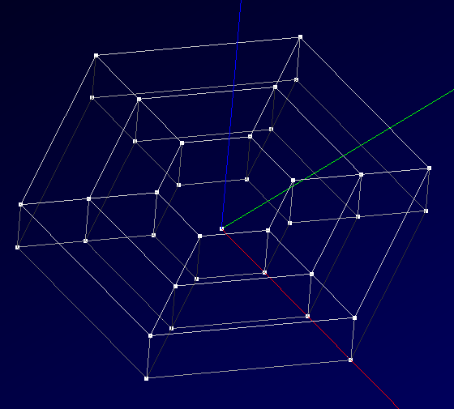

:tocdepth: 3

.. _blockmethod:

=======================
Build a model of blocks
=======================

What is a model of blocks ?
===========================

A block (or a hexahedron) is a volume defined by:
    - 8 vertices
    - 12 edges
    - 6 quadrangular faces

A model of blocks is a set of blocks.

And for each quadrangle of a model of blocks, this quadrangle is:
    - or a free face
    - or a face shared between 2 blocks

How to find a model of blocks ?
===============================

In this version of HEXABLOCK component, the user must find himself the model of blocks that is adapted for his geometry.
 
.. _modelbloc:

How to create a model of blocks ?
=================================

When the user find the model of blocks necessary for his geometry to be meshed with hexahedra,
HEXABLOCK component has a lot of tool to build this model of blocks:

- basic functions:
    - create one hexahedron
    - create a hexahedra with 2, 3, 4 or 5 quadrangles
    - remove hexahedra

- grid building:
    - cartesian grid
    - cylindrical grid
    - spherical grid
        
- predefined model of blocks:
    - for cylinder
    - for pipe
    - for two intersected cylinders
    - for two intersected pipes
    - for hemisphere
    - for ring

- powerfull functions:
    - prism quadrangles
    - join quadrangles
    - make hexahedra by revolution of quadrangles
    - cut an edge to slice hexahedra
    - replace an hexadron by a pattern

- by transformation:
    - translation
    - rotation
    - scale

- by symetry:
    - with a point
    - with a line
    - with a plane

- by merging:
    - of two vertices
    - of two edges
    - of two quadrangles

- by disconnection:
    - of two vertices
    - of two edges
    - of two quadrangles

Example of simple model of blocks
=================================

.. centered::
   An exemple of a model with 12 blocks
