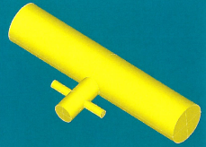
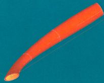

:tocdepth: 3

.. _cad:

=============================================
Import or build a geometry without constraint
=============================================

A main feature of HEXABLOCK is to define a geometry without constraint for hexahedral meshing.

The user has two ways to define the geometry for meshing:

- import a geometry from a STEP, IGES or BREP file,

- build a geometry with GEOM component.

The following pictures show different geometries for exemples:

.. image:: _static/cad_bielle.png
   :align: center

.. centered::
   Connecting rod 

(see :ref:`intropython`)

.. image:: _static/bride.png
   :align: center

.. centered::
   Bridle

.. centered::
   Intersection of cylinders

.. centered::
   Bent (curved) pipe

