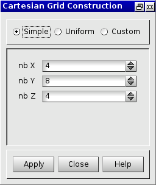
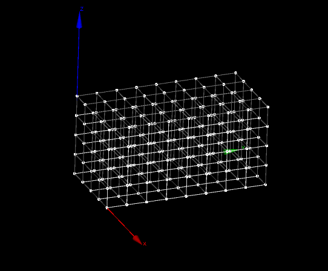
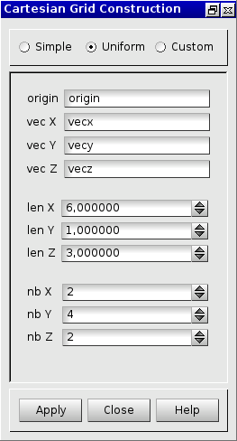
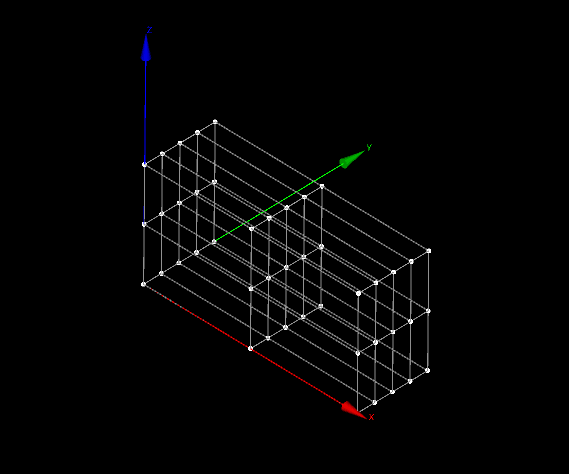
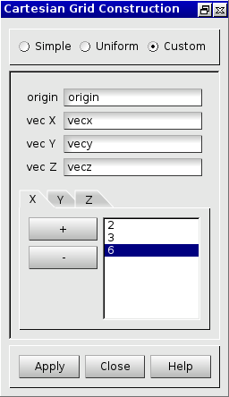

:tocdepth: 3

.. _creategrids:

======================
Create cartesian grids
======================

To create a **Cartesian Grid** in the **Main Menu** select **Model -> Construction -> Make Grid**.

Three kinds of grid can be created:

- simple cartesian grid (see :ref:`guicartgridsimple`),
- uniform cartesian grid (see :ref:`guicartgriduniform`),
- custom cartesian grid (see :ref:`guicartgridcustom`).

.. _guicartgridsimple:

Simple cartesian grid
=====================

To create a simple cartesian grid, select radio button **Simple**:

.. centered::
      Dialogue Box for a Simple cartesian grid

The following data are required:

- *nb X*: The number of hexahedra along the X axis
- *nb Y*: The number of hexahedra along the Y axis
- *nb Z*: The number of hexahedra along the Z axis

The result of this action is:

.. centered::
   Simple Cartesian Grid

TUI command: :ref:`tuicartgridsimple`

.. _guicartgriduniform:

Uniform cartesian grid
======================

To create an uniform cartesian grid, select radio button **Uniform**:

.. centered::
   Dialogue Box for an Uniform cartesian grid

The following data are required:

- *origin*: The vertex of the origin
- *vec X* : The X vector
- *vec Y* : The Y vector
- *vec Z* : The Z vector
- *len X* : The length of an hexahedra on the X axis
- *len Y* : The length of an hexahedra on the Y axis
- *len Z* : The length of an hexahedra on the Z axis
- *nb X*  : The number of hexahedra on the X axis
- *nb Y*  : The number of hexahedra on the Y axis
- *nb Z*  : The number of hexahedra on the Z axis

Clicking on "Apply" on the previous dialog box will produce the following grid (Uniform hexahedra, different sizes on the three axis):

.. centered::
   Unfiorm cartesian grid

TUI command: :ref:`tuicartgriduniform`

.. _guicartgridcustom:

Custom cartesian grid
=====================

To create a Custom cartesian grid, select radio button **Custom**:

.. centered::
   Dialogue Box for a Custom cartesian grid

The following data are required:

- *origin*: The vertex of the origin
- *vec X* : The X vector
- *vec Y* : The Y vector
- *vec Z* : The Z vector
- *X*     : A list of x values in ascendant order
- *Y*     : A list of y values in ascendant order
- *Z*     : A list of z values in ascendant order

A value on each axis gives the length of an hexahedra on that axis from the origin of the grid.
For example the first value in the list of x values is the length on X axis of the first hexahedra from the origin.

The result of this action is:

.. image:: _static/cartgridcustom.png
   :align: center

.. centered::
   Custom cartesian grid

TUI command: :ref:`tuicartgridcustom`
