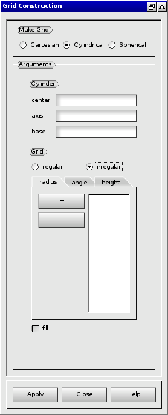
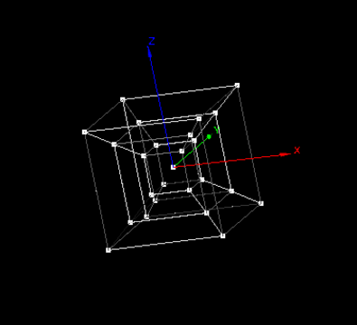

:tocdepth: 3

.. _creategrids:

============
Create grids
============

To create a **Grid** in the **Main Menu** select **Model -> Construction -> Make Grid**.

Three kinds of grid can be created:

- cartesian grid (see :ref:`guicartgrid`),
- cylindrical grid (see :ref:`guicylgrid`),
- spherical grid (see :ref:`guisphergrid`).

.. _guicartgrid:

Cartesian grid
==============

To create a cartesian grid, select radio button **Cartesian**:

.. image:: _static/gui_make_cart_grid.png
   :align: center

.. centered::
      Dialogue Box for a Cartesian grid

The following data are required:

- the vertex of the initial hexahedron,
- the vector corresponding to the diametrically opposite vertex to the initial vertex,
- the number of repetition of this hexahedra along the three axes
  (n(x), n(y) and n(z)).

The result of this action is:

.. image:: _static/cartgrid3.png
   :align: center

.. centered::
   Result Cartesian Grid

TUI command: :ref:`tuicartgrid`

.. _guicylgrid:

Cylindrical grid
================

To create a cylindrical grid, select radio button **Cylindrical**:

.. image:: _static/gui_make_cyl_grid.png
   :align: center

.. centered::
   Dialogue Box for a Cylindrical grid (regular size)

The following data are required:

- Cylinder
    - center: coordinates of the cylinder base center (select a vertex).
    - axis: direction vector of the cylinder (select a vector).
    - base: base vector of the cylinder (select a vector).

- Grid
    - radius: size and number of elements from the center.
    - angle: size and number of elements around the center.
    - height: size and number of elements on height.
    - fill: choose this option to fill the central part of the hexhahedra.

Elements size of the grid can be irregular (differents sizes). Select the adequate radio button:

.. centered::
   Dialogue Box for a Cylindrical grid (irregular size)
   

The result:

.. image:: _static/cylgrid1.png
   :align: center

.. image:: _static/cylgrid2.png
   :align: center

.. image:: _static/cylgrid5.png
   :align: center

.. image:: _static/cylgrid6.png
   :align: center

.. centered::
   Cylindrical grids with different filling cases

TUI command: :ref:`tuicylgrid`

.. _guisphergrid:

Spherical grid
===============

To create a spherical grid, select radio button **Spherical**:

.. image:: _static/gui_make_spher_grid.png
   :align: center

.. centered::
   Dialogue Box for a Spherical grid

The following data are required:

- the center (vertex) of the central hexahedron,
- the radius of the internal hexahedron
- the number of embedded hexahedra (nb),
- the coefficient of growth (k).

The result is an array of hexahedra starting with the central and
other hexahedral are arranged layer by layer from the center. Each
layer contains six hexahedral always in the following order: two along
the X axis, then two for the Y axis and two for the Z axis.

The result of this action is:

.. centered::
   Resulting Spherical grid

TUI command: :ref:`tuisphergrid`
