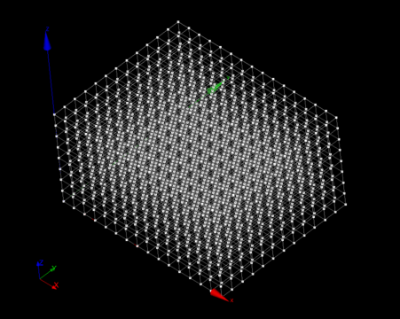
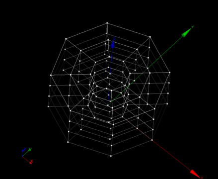

:tocdepth: 3

.. _creategrids:

============
Create grids
============

To create a **Grid** in the **Main Menu** select **Model -> Make grid** 

Three kinds of grid can be created:

- cartesian grid (see :ref:`guicartgrid`)
- cylindrical grid (see :ref:`guicylgrid`)
- spherical grid (see :ref:`guisphergrid`)

.. _guicartgrid:

Cartesian grid
==============

To create a cartesian grid, the following data are required:

- the vertex of the initial hexahedron
- the vector corresponding to the diametrically opposite vertex to the initial vertex
- the number of repetition of this hexahedra along the three axes
  (n(x), n(y) and n(z))

The dialogue box for the creation of a cartesian grid is:

.. image:: _static/gui_make_cart_grid.png
   :align: center

.. centered::
      Dialogue Box for a Cartesian grid

The result of this action is:

.. centered::
   Result Cartesian Grid

TUI command: :ref:`tuicartgrid`

.. _guicylgrid:

Cylindrical grid
================

To create a cylindrical grid, the following data are required:

- the coordinates (vertex) of the cylinder base center
- the vectors defining the axe and the direction of the cylinder
- the radial, angular and axial sizes: *dr, da, dl*
- the radial, angular and axial elements number: *nr, na, nl*
- choose to fill or not the central part of the hexahedra

Example:

.. image:: _static/gui_make_cyl_grid.png
   :align: center

.. centered::
   Dialogue Box for a Cylindrical grid

The result is an array of hexahedra which are arranged along the
radial axis first, then the angular axis, then according to the layers
and then possibly hexahedra filling the central part.

The filling the central part of the cylinder is made​according to the two following cases:

.. image:: _static/cyl_grid2.PNG
   :align: center

.. centered::
   Filling of the central part of the cylinder in the case the number of angular elements is odd na = 5.

.. image:: _static/cyl_grid1.PNG
   :align: center

.. centered::
   Filling of the central part of the cylinder in the case the number of angular elements is even na = 4.

The result:

.. image:: _static/cylgrid3.png
   :align: center

.. image:: _static/cylgrid4.png
   :align: center

.. centered::
   Cylindrical grids with different filling cases

TUI command: :ref:`tuicylgrid`

.. _guisphergrid:

Spherical grid
===============

To create a spherical grid, the following data are required:

- the center (vertex) of the central hexahedron
- the vector corresponding to the diametrically opposite vertex to the
  initial vertex
- the number of embedded hexahedra (nb)
- the coefficient of growth (k)

Example:

.. image:: _static/gui_make_spher_grid.png
   :align: center

.. centered::
   Dialogue Box for a Spherical grid

The result is an array of hexahedra starting with the central and
other hexahedral are arranged layer by layer from the center. Each
layer contains six hexahedral always in the following order: two along
the X axis, then 2 for the Y axis and 2 for the Z axis.

The result of this action is:

.. image:: _static/sph_grid.png
   :align: center

.. centered::
   Resulting Spherical grid

TUI command: :ref:`tuisphergrid`
