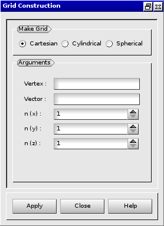
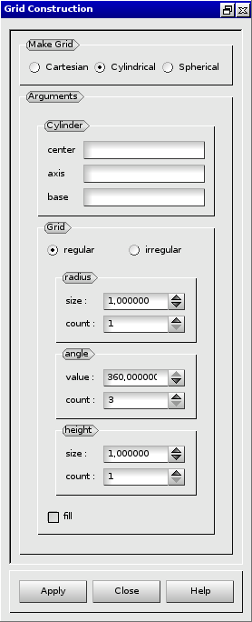
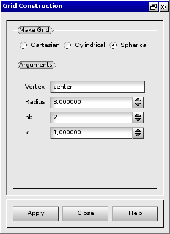

:tocdepth: 3

.. _creategrids:

============
Create grids
============

To create a **Grid** in the **Main Menu** select **Model -> Make grid** 

Three kinds of grid can be created:

- cartesian grid (see :ref:`guicartgrid`)
- cylindrical grid (see :ref:`guicylgrid`)
- spherical grid (see :ref:`guisphergrid`)

.. _guicartgrid:

Cartesian grid
==============

To create a cartesian grid, the following data are required:

- the vertex of the initial hexahedron
- the vector corrsponding to the diametrically opposite vertex to the initial vertex
- the number of repetition of this hexahedra along the three axes
  (n(x), n(y) and n(z))

The dialogue box for the creation of a cartesian grid is:

.. centered::
      Dialogue Box for a Cartesian grid

The result of this action is:

**todo a revoir:**

.. image:: _static/cartgrid1.PNG
   :align: center

.. centered::
   Result Cartesian Grid

TUI command: :ref:`tuicartgrid`

.. _guicylgrid:

Cylindrical grid
==================

To create a cylindrical grid, the following data are required:

- the coordinates (vertex) of the cylinder base center
- the vectors defining the axe and the direction of the cylinder
- the radial, angular and axial sizes: *dr, da, dl*
- the radial, angular and axial elements number: *nr, na, nl*
- choose to fill or not the central part of the hexahedra

Example:

.. centered::
   Dialogue Box for a Cylindrical grid

The result:

**todo a revoir:**

.. image:: _static/db_cylgrid.PNG
   :align: center

.. centered::
   Cylindrical grid

TUI command: :ref:`tuicylgrid`

.. _guisphergrid:

Spherical grid
===============

To create a spherical grid, the following data are required:

- the vertex of the central hexahedron
- the vector corrsponding to the diametrically opposite vertex to the
  initial vertex
- the number of embedded hexahedra (nb)
- **todo k ??????** 

Example:

.. centered::
   Dialogue Box for a Spherical grid

The result of this action is:

**todo a revoir:**

.. image:: _static/sph_grid.PNG
   :align: center

.. centered::
   Resulting Spherical grid

TUI command: :ref:`tuisphergrid`
