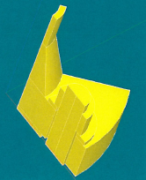

:tocdepth: 4

.. _fullexample:

#################################
Example generated from Hexablock
#################################

*todo a revoir*

.. centered::
   Bridle

::

	# -*- coding: latin-1 -*-

	import os
	import GEOM
	import geompy
	import smesh
	import hexablock
	import math
	import SALOMEDS

	STEP_PATH = os.path.expandvars("$HEXA_ROOT_DIR/bin/salome/crank.stp")

	doc = hexablock.addDocument()
	OPT_QUAD_IK = 1
	OPT_FIRST   = 2

	# ======================================================== merge_quads
	def merge_quads (doc, quart, demi, ni1, nj1, ni2, nj2, option=0) :

    	prems   = option == OPT_QUAD_IK 
    	quad_ik = option == OPT_FIRST 

    	if quad_ik : orig = quart.getQuadIK (ni1, nj1, k1)
   	 else       : orig = quart.getQuadJK (ni1, nj1, k1)

    	dest = demi .getQuadJK (ni2, nj2, k1)

    	v1 = dest.getVertex (quad_ik);
    	v3 = dest.getVertex (1-quad_ik);
   
    	v2 = orig.getVertex (0);
    	v4 = orig.getVertex (1);

    	doc.mergeQuads (dest, orig, v1, v2, v3, v4);

	#================================================================================= Begin
	orig1 = doc.addVertex (0,0,0)
	orig2 = doc.addVertex (6,0,0)

	dz = doc.addVector (0,0,1)
	dx = doc.addVector (1,0,0)

	dim_z  = 5
	drd = 0.5
	drq = 2*drd
	dl  = 1
	nrq = 8
	nrd = 3
	naq = 4
	nad = 8
	k0  = 0
	k1  = 1

	quart = doc.makeCylindrical (orig1,dx,dz,drq, 45, 
                             dl,nrq,naq,dim_z, True)
	for nk in range (dim_z-2) :
             ##  Elagage du quart (de brie)
    	for nj in range (naq) :
       	ideb = 2
       	if nk==dim_z-1  : ideb = 1
       	for nj in range (naq) :
         	  for ni in range (nrq-ideb) :
               	doc.removeHexa (quart.getHexaIJK (ni+ideb, nj, nk+2));

                              	 ## La semelle
	for nj in range (naq) :
    	for ni in range (nrq-2) :
        	doc.removeHexa (quart.getHexaIJK (ni+2, nj, k0));

                          	     ## Le demi 
	demi = doc.makeCylindrical (orig2,dx,dz,drd, 180, dl,nrd,nad, dim_z, True);

	for nk in range (dim_z-2) :
    	for nj in range (nad) :
        	ni0 = max (nrd-nk, 0);
        	for ni in range (nrd-ni0) :
           	 doc.removeHexa (demi.getHexaIJK (ni+ni0, nj, nk+2))

	jmax= nrq-1;
	for nj in range (2) :
   	for ni in range (jmax-3) :
       	doc.removeHexa (quart.getHexaIJK (ni+3, nj, k1))

	###merge_quads (doc, quart, demi, 7, 0,   nrd, 0, OPT_FIRST);
	###rge_quads (doc, quart, demi, 7, 1,   nrd, 1);

	#______________________________________________________________

	###  mesh = smesh.HexaBlocks(doc)
	mesh = hexablock.mesh("bride:hexas", doc)

                    

