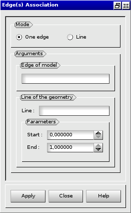

:tocdepth: 3

.. _guiassoquadtogeom:

=============================================================
Associate a quadrangle of the model of blocks to the geometry
=============================================================

To associate a quadrangle of the model of blocks to the geometry in
the **Main Menu** select **Association -> todo : a completer**

.. _guiassovertex:

Associate to a vertex of the geometry
=====================================

*todo !!*

The dialogue box to associate to a vertex of the geometry is:

.. image:: _static/gui_ass_vertex.png
   :align: center

.. centered::
   Associate to a Vertex of the Geometry

.. _guiassoedge:

Associate to an edge or a wire of the geometry
==============================================

*todo !!*

The dialogue box to associate to an edge or a wire of the geometry is:

.. centered::
   Associate to an Edge or a Wire of the Geometry

.. _guiassoface:

Associate to a face or a shell of the geometry
==============================================

*todo !!*

The dialogue box to associate to a face or a shell of the geometry is:

.. image:: _static/gui_ass_face.png
   :align: center

.. centered::
   Associate to a Face or a Shell of the Geometry

Associate line
==============

*todo : associateOpenedLine et  associateClosedLine : a revoir*

TUI command: :ref:`tuiassoquadtogeom`
