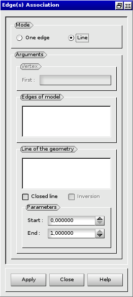

:tocdepth: 3

.. _guiassoquadtogeom:

=============================================
Associate the model of blocks to the geometry
=============================================

The association of the model of blocks to the geometry proceeds in three steps:

- associate all vertices,
- associate the needed edges,
- associate the needed quadrangles.

To facilitate the association of the model to the geometry, a more easy way exists:
the association of lines taken from the model to lines taken from the geometry.

The interaction for an association of an element of the model of blocks to the geometry
proceeds in three stages:

- select the model element(s) to associate,
- select the shape(s) of the geometry to associate to,
- make the association,

.. _guiassovertex:

Vertex Association
==================

To associate a vertex of the model of blocks to a vertex of the geometry in
the **Main Menu** select **Association -> Make Vertex association**

**Arguments:**

- vertex of the model of blocks,
- vertex of the geometry.

The dialogue box to associate to a vertex of the geometry is:

.. image:: _static/gui_vertex_assoc_coordinates.png
   :align: center

.. centered::
   Associate to a Vertex of the Geometry
   
see: :ref:`guiassovertex2`

see: :ref:`tuiassovertex2`

.. _guiassoedge:

Edge(s) Association
===================

To associate edge(s) of the model of blocks to line(s) of the geometry in
the **Main Menu** select **Association -> Make Edge Association**

.. _guiassooneedge:

One edge
--------

Only one edge of the model is associated.

**Arguments:**

- one edge of the model of blocks,
- one line of the geometry,
- Start: starting point on the line,
- End: ending point on the line.

The dialogue box to associate one edge or wire of the geometry is:

.. image:: _static/gui_ass_edge.png
   :align: center

.. centered::
   Associate an Edge or Wire of the Geometry

.. _guiassoedges:

Line
----

One or several edges and vertices of the model are associated.
 
**Arguments:**

- starting vertex (only if "closed line" is selected),
- one or several edges of the model of blocks,
- one or several lines of the geometry,
- choose to associate a closed line or an opened line,
- choose to associte a closed line with inversion (only if "closed line" is selected),
- Start: starting point on the line,
- End: ending point on the line.

The dialogue box to associate to edges or wires of the geometry is:

.. centered::
   Associate to Edges or Wires of the Geometry

.. _guiassoface:

Quadrangle Association
======================

To associate a quadrangle of the model of blocks to a face of the geometry in
the **Main Menu** select **Association -> Make Quadrangle association**

**Arguments:**

- quadrangle of the model of blocks,
- list of faces of the geometry.

The dialogue box to associate to a face or a shell of the geometry is:

.. image:: _static/gui_ass_quad.png
   :align: center

.. centered::
   Associate to a Face or a Shell of the Geometry

Note
----

Face association (implicite or explicite) is not necessary for:

- planar faces, 
- cylindrical faces,
- conical faces.

Only edges association (implicite) on segments or arcs of cirle is necessary.

This case is illustrated by an example :ref:`here <tuiassocfacenote>`.

TUI command: :ref:`tuiassoquadtogeom`
