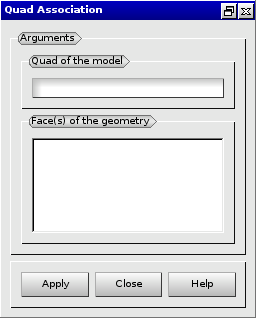

:tocdepth: 3

.. _guiassoquadtogeom:

=============================================
Associate the model of blocks to the geometry
=============================================

The association of an element of the model of blocks to the geometry
proceeds in three stages :

- select the model element to associate
- select the shape of the geometry to associate to
- make the association

The hexablock application enables to associate elements independantly. 
To facilitate the association of the model
to the geometry, an alternative way exists: the association of
vertices and the association of lines can be replaced association by
lines.

.. _guiassovertex:

Associate to a vertex of the geometry
=====================================

To associate a vertex of the model of blocks to a point of the geometry in
the **Main Menu** select **Model -> Make Vertex association**

*todo : plantage salome a l'ouverture de la fenetre de dialogue!!*

**Arguments:**

- vertex of the model of blocks
- point of the geometry

The dialogue box to associate to a vertex of the geometry is:

.. image:: _static/gui_ass_vertex.png
   :align: center

.. centered::
   Associate to a Vertex of the Geometry

.. _guiassoedge:

Associate to edges or wires of the geometry
===========================================

To associate edge(s) of the model of blocks to line(s) of the geometry in
the **Main Menu** select **Model -> Make Edge association**

**Arguments:**

- starting vertex (only if "closed line" is selected)
- one or several edges of the model of blocks
- one or several lines of the geometry
- choose to associate a closed line or an opened line
- Start: starting point on the line
- End: ending point on the line

The dialogue box to associate to edges or wires of the geometry is:

.. image:: _static/gui_ass_edge.png
   :align: center

.. centered::
   Associate to Edges or Wires of the Geometry

.. _guiassoface:

Associate to a face or a shell of the geometry
==============================================

To associate a quadrangle of the model of blocks to a face of the geometry in
the **Main Menu** select **Model -> Make Quad association**

**Arguments:**

- quadrangle of the model of blocks
- list of faces of the geometry

The dialogue box to associate to a face or a shell of the geometry is:

.. centered::
   Associate to a Face or a Shell of the Geometry

TUI command: :ref:`tuiassoquadtogeom`
