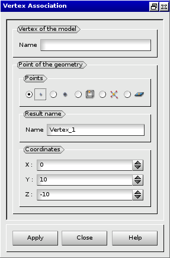
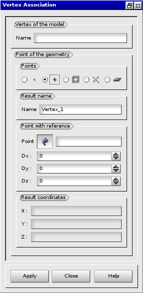
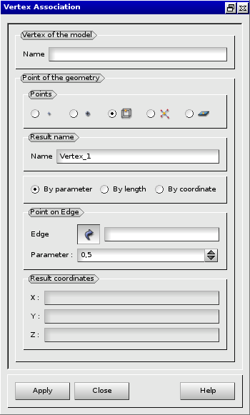
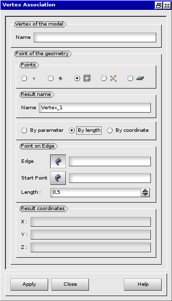
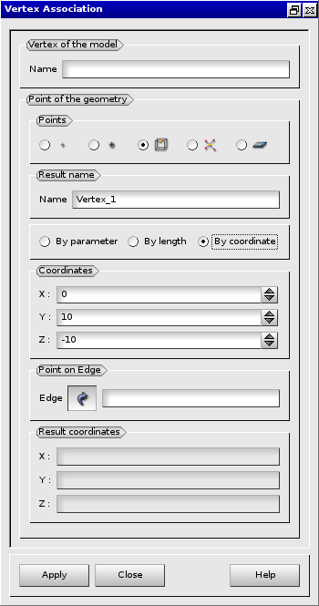
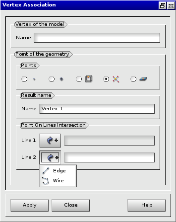
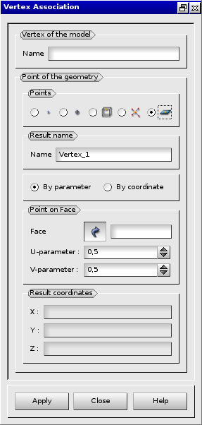
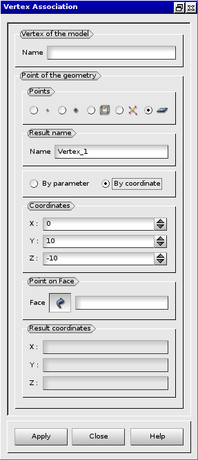

:tocdepth: 3

.. _guiassovertex2:

========================================
GUI: Definition of point of the geometry
========================================

To make a vertex association you need to define the Geom Point you want to associate 
your vertex to.

There are five algorithms to create a Point in the 3D space in Geom. 
Each time the Result of the operation will be a GEOM_Object (vertex).

.. _guiassovertexcoords:

By coordinates
==============

Firstly, we can define a point by setting its X, Y and Z Coordinates.

**Arguments:**

- Name of the vertex of the model
- Name of the resulting point
- X, Y and Z coordinates of the point

The dialogue box to associate a vertex to a point defined by its coordinates is:

.. centered::
   Point defined by its coordinates

.. _guiassovertexref:

By a reference
==============

Secondly, we can define a point by a Reference to another point and the shift of the coordinates of the new point regarding the coordinates of the old one. 

**Arguments:**

- Name of the vertex of the model
- Name of the resulting point
- 1 reference point
- 3 coordinates defining the position of this point regarding the reference one

The dialogue box to associate a vertex to a point defined by a reference is:

.. centered::
   Point defined by reference to a point of the geometry and a translation

.. _guiassovertexedgeparam:

By an Edge and a Parameter
==========================

Thirdly, we can define a point by an Edge and a Parameter indicating its position on the Edge, ranging from 0.0 to 1.0. For example, 0.5 means that the point is located in the middle of the edge. 

**Arguments:**

- Name of the vertex of the model
- Name of the resulting point
- 1 edge
- 1 Parameter defining the position of the point on the given edge

The dialogue box to associate a vertex to a point of the geometry defined by an edge and parameter:

.. centered::
   Point defined by an edge and a parameter
   
   
.. _guiassovertexedgelength:

By an Edge and a Length
=======================

Alternatively, it is possible to define a point by an Edge and a Length. 
The Length defines the position of the point on the given edge. 
It can exceed the length of the edge or be negative. 
In this case the edge is extrapolated along its curve (except for bezier and b-spline curves). 
The Start Point defines the direction for the length calculation (if not defined, the first vertex of Edge is used, else the vertex of Edge closest to StartPoint is used). 

**Arguments:**

- Name of the vertex of the model
- Name of the resulting point
- 1 edge 
- 1 Point
- 1 Length

The dialogue box to associate a vertex to a point of the geometry defined by an edge and a length:

.. centered::
   Point defined by an edge and a length
   
   
.. _guiassovertexedgecoords:

By an Edge and Coordinates
==========================

It is also possible to define 3D coordinates of the point projected on the given edge to produce the resulting point. 

**Arguments:**

- Name of the vertex of the model
- Name of the resulting point
- 3 coordinate values of the projected point
- 1 edge

The dialogue box to associate a vertex to a point of the geometry defined by an edge and coordinates:

.. centered::
   Point defined by an edge and 3 coordinates
   
   
.. _guiassovertexlineintersect:

By intersection of two Lines or Wires
=====================================

Fourthly, we can define a point(s) by intersection of two Lines or Wires (or a Wire and a Line).
If they intersect only once, a point will be created. If there are several intersections, a compound of points will be created. 
The type of the selected object (Line or Wire) can be changed in the popup menu, after clicking the corresponding selection button. (see the picture below) 

**Arguments:**

- Name ot he vertex of the model
- Name of the resulting point
- 2 1D objects (Line or Wire)

The dialogue box to associate a vertex to a point of the geometry defined by the intersection of two lines or wires is:

.. centered::
   Point defined by the intersection of two lines or wires
   
   
.. _guiassovertexpointonfaceparams:

By a face and two parameters
============================

Finally, we can define a point by a Face and Two Parameters: U and V indicating its position on the Face, ranging from 0.0 to 1.0. 
For example, (0.5; 0.5) means that the point is located in the middle of the face. 

**Arguments:**

- Name of the vertex of the model
- Name of the resulting point
- 1 face
- 2 Parameters defining the position of the point on the given face

The dialogue box to associate a vertex to a point on a face using U and V parameters is:

.. centered::
   Point defined by a face and two parameters  
   
      
.. _guiassovertexpointonfacecoords:

By a face and coordinates
=========================

Alternatively, it is possible to define 3D coordinates of the point projected on the given face.

**Arguments:**

- Name of the vertex of the model
- Name of the resulting point
- 3 coordinate values to project point on the given face
- 1 face

The dialogue box to associate a vertex to a point on a face using coordinates is:

.. centered::
   Point defined by a face and 3 coordinates
   

GUI: :ref:`guiassovertex`
