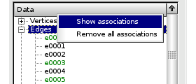

:tocdepth: 3

.. _guiassocs:

============
Associations
============

.. _guishowassocs:

Show associations
=================

To show all associations of a given type (only vertex, edge and quad can be associated), 
right click on the tree of the type in the data tree and click on the menu "Show associations".

The contextual menu shown when you right-click looks like this:

.. centered::
   Show associations

When you select an element (an edge for instance) in the data tree or in a graphic view (vtk/occ), all elements associated to it will be highlighted in the data tree and the graphic views.  

.. _guiremoveassocs:

Remove all associations
=======================

Just like "Show associations" but select the menu "Remove all associations".

.. centered::
   Remove all associations

.. _guiremoveassoc:

Remove an element's association(s)
==================================

Right-click on the element in the data tree and select the menu "Remove association(s)".

.. centered::
   Remove an element's associations

TUI command: :ref:`tuiassocs`