:tocdepth: 3

.. _guiblockscylinderpipe:

================================
Cylinders and Pipes Construction
================================

.. _guicylinder:

Cylinder
========

To make a **Cylinder** in the **Main Menu** select **Model -> Construction -> Make Cylinder**.

.. _guicylindersimple:

Simple Cylinder
---------------

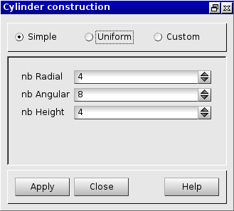

.. centered::
      Dialog Box to make a Simple Cylinder

The following data are required:

- *nb Radial*  : number of hexahedra on radial.
- *nb Angular* : number of hexahedra along the perimeter of the cylinder.
- *nb Height*  : number of hexahedra along the axis of the cylinder.

Clicking on "Apply" on the previous dialog box will produce the following result:

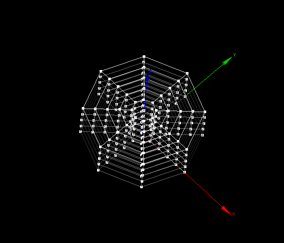

.. centered::
   Simple Cylinder

The result is an array of hexahedral ranked first by following the
radial direction and the angular direction, then according to the
layers in the cylinder axis.

TUI command: :ref:`tuicylindersimple`

.. _guicylinderuniform:

Uniform Cylinder
----------------

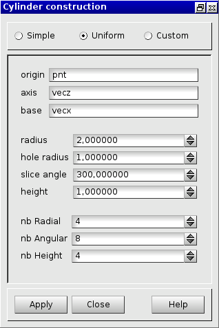

.. centered::
      Dialog Box to make a Uniform Cylinder

The following data are required:

- *origin* 	   : origin's coordinates of the cylinder (select a vertex).
- *axis*	   : the axis of the cylinder (select a vector).
- *base*       : the base of the cylinder (select a vector).
- *radius*     : the radius of the cylinder.
- *hole radius*: the radius of the hole in the cylinder .
- *slice angle*: angle of the cylinder around the Z axis.
- *height*     : the height of the cylinder.
- *nb Radial*  : number of hexahedra on radial.
- *nb Angular* : number of hexahedra along the perimeter of the cylinder.
- *nb Height*  : number of hexahedra along the axis of the cylinder.

Clicking on "Apply" on the previous dialog box will produce the following result:

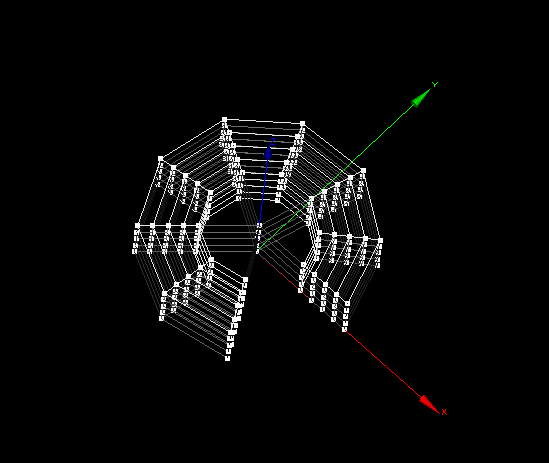

.. centered::
   Uniform Cylinder

TUI command: :ref:`tuicylinderuniform`

.. _guicylindercustom:

Custom Cylinder
---------------

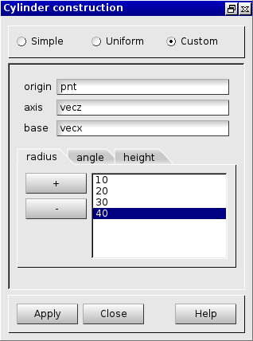

.. centered::
      Dialog Box to make a Custom Cylinder

The following data are required:

- *origin* 	   : origin's coordinates of the cylinder (select a vertex).
- *axis*	   : the axis of the cylinder (select a vector).
- *base*       : the base of the cylinder (select a vector).
- *radius*     : a list of radiuses in ascendant order.
- *angle*      : a list of angles in ascendant order. 
- *height*     : a list of heights in ascendant order.

Clicking on "Apply" on the previous dialog box will produce the following result:

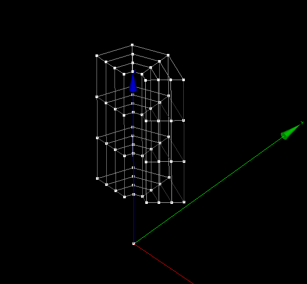

.. centered::
   Custom Cylinder

TUI command: :ref:`tuicylindercustom`

.. _guicylinders:

Cylinders
=========

To make **two cylinders in T shape** in the **Main Menu** select **Model -> Construction -> Make Cylinders** 

The dialogue box to make cylinders is:

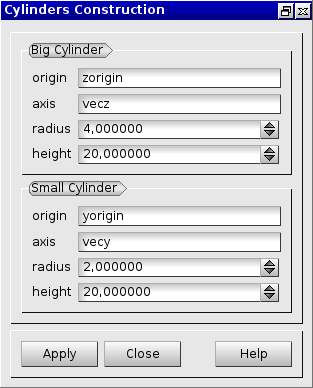

.. centered::
   Make Cylinders

The following data are required:

- *origin* 	   : the origin of the cylinder (select a vertex).
- *axis*	   : the axis of the cylinder (select a vector).
- *radius*     : the radius of the cylinder.
- *height*      : the height of the cylinder. 

Those arguments must be filled for the **Big Cylinder** and the **Small Cylinder**.

Clicking on "Apply" on the previous dialog box will produce the following result:

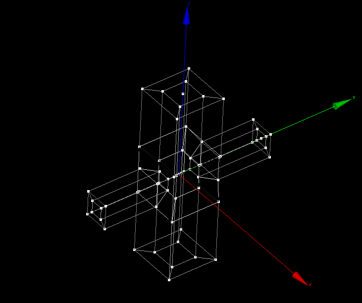

.. centered::
   Make Cylinders (T Shape)

TUI command: :ref:`tuicylinders`

.. _guipipe:

Pipe
====

To make a **Pipe** in the **Main Menu** select **Model -> Construction -> Make Pipe**.

.. _guipipesimple:

Simple Pipe
-----------

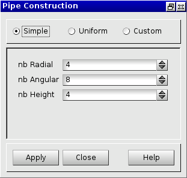

.. centered::
      Dialog Box to make a Simple Pipe

The following data are required:

- *nb Radial*  : number of hexahedra on radial.
- *nb Angular* : number of hexahedra along the perimeter of the pipe.
- *nb Height*  : number of hexahedra along the axis of the pipe.

TUI command: :ref:`tuipipesimple`

.. _guipipeuniform:

Uniform Pipe
------------

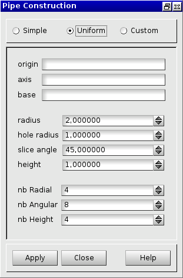

.. centered::
      Dialog Box to make a Uniform Pipe

The following data are required:

- *origin* 	   : origin's coordinates of the pipe (select a vertex).
- *axis*	   : the axis of the pipe (select a vector).
- *base*       : the base of the pipe (select a vector).
- *radius*     : the radius of the pipe.
- *hole radius*: the radius of the hole in the pipe.
- *slice angle*: angle of the pipe around the Z axis.
- *height*     : the height of the pipe.
- *nb Radial*  : number of hexahedra on radial.
- *nb Angular* : number of hexahedra along the perimeter of the pipe.
- *nb Height*  : number of hexahedra along the axis of the pipe.

TUI command: :ref:`tuipipeuniform`

.. _guipipecustom:

Custom Pipe
-----------

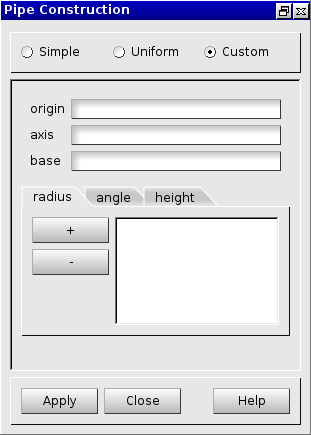

.. centered::
      Dialog Box to make a Custom Pipe

The following data are required:

- *origin* 	   : origin's coordinates of the pipe (select a vertex).
- *axis*	   : the axis of the pipe (select a vector).
- *base*       : the base of the pipe (select a vector).
- *radius*     : a list of radiuses in ascendant order.
- *angle*      : a list of angles in ascendant order. 
- *height*     : a list of heights in ascendant order.

TUI command: :ref:`tuipipecustom`

.. _guipipes:

Pipes
=====

To make **two intersect pipes** in the **Main Menu** select **Model -> Construction -> Make Pipes**.

The dialogue box to make pipes is:

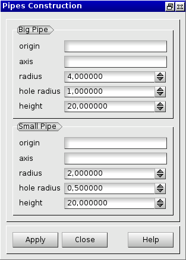

.. centered::
   Make Pipes

You can make **Pipes** (T Shape) through a **Big Pipe** and a **Small Pipe**. 

The following data are required:

- *origin* 	   : the origin of the pipe (select a vertex).
- *axis*	   : the axis of the pipe (select a vector).
- *radius*     : the radius of the pipe.
- *hole radius*: the radius of the hole in the pipe.
- *height*     : the height of the pipe. 

Those arguments must be filled for the **Big Pipe** and the **Small Pipe**.

TUI command: :ref:`tuipipes`
