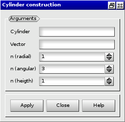
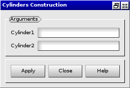
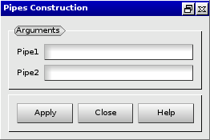

:tocdepth: 3

.. _guiblockscylinderpipe:

=====================================
Make blocks for a cylinder and a pipe
=====================================

.. _makecylinder:

Make Cylinder
=============

To make a **Cylinder** in the **Main Menu** select **Model -> Make cylinder**.

To make a cylinder, the following data are required:

- Cylinder: cylinder

- Vector: vector on the base of the cylinder to start hexahedra.

- nr: number of blocks on radial.

- na: number of angular section.

- nl: number of blocks along the axis of the cylinder.

The dialogue box to make a cylinder is:

.. centered::
   Make a Cylinder

.. _makecylinders:

Make Cylinders
==============

To make **Cylinders** in the **Main Menu** select **Model -> Make cylinders** 

You can make **Cylinders** through **Cylinder1** and **Cylinder2**.

**Arguments:** 2 cylinders

The dialogue box to make cylinders is:

.. centered::
   Make Cylinders

.. _makepipe:

Make Pipe
=============

To make a **Pipe** in the **Main Menu** select **Model -> Make pipe** 

To make a pipe, the following data are required:

- Pipe: pipe

- Vector: vector on the base of the pipe to start hexahedra.

- nr: number of blocks on radial.

- na: number of angular section.

- nl: number of blocks along the axis of the pipe.

The dialogue box to make a pipe is:

.. image:: _static/gui_make_pipe.png
   :align: center

.. centered::
   Make a Pipe

.. _makepipes:

Make Pipes
==============

To make **Pipes** in the **Main Menu** select **Model -> Make pipes** 

You can make **Pipes** through **Pipe1** and **Pipe2**.

**Arguments:** 2 pipes

The dialogue box to make pipes is:

.. centered::
   Make Pipes

TUI command: :ref:`tuiblockscylinderpipe`
