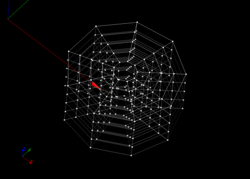

:tocdepth: 3

.. _guiblockscylinderpipe:

=====================================
Make blocks for a cylinder and a pipe
=====================================

.. _makecylinder:

Make Cylinder
=============

To make a **Cylinder** in the **Main Menu** select **Model -> Make Cylinder**.

To make a cylinder, the following data are required:

- Cylinder: a cylinder.
- Vector: a vector on the base of the cylinder to start hexahedra.
- nr: the number of blocks on radial.
- na: the number of angular section.
- nl: the number of blocks along the axis of the cylinder.

The dialogue box to make a cylinder is:

.. image:: _static/gui_make_cylinder.png
   :align: center

.. centered::
   Make a Cylinder

The result is an array of hexahedral ranked first by following the
radial direction and the angular direction, then according to the
layers in the cylinder axis.

The result of this action is:

.. image:: _static/cylinder.png
   :align: center

.. centered::
   Cylinder

.. _makecylinders:

Make Cylinders
==============

To make **two cylinders in T shape** in the **Main Menu** select **Model -> Make Cylinders** 

You can make **Cylinders** through **Cylinder1** and **Cylinder2**.

**Arguments:** 2 cylinders.

The dialogue box to make cylinders is:

.. image:: _static/gui_make_cylinders.png
   :align: center

.. centered::
   Make Cylinders

The result is an array of hexahedral.

.. _makepipe:

Make Pipe
=========

To make a **Pipe** in the **Main Menu** select **Model -> Make Pipe**.

To make a pipe, the following data are required:

- Pipe: a pipe.
- Vector: a vector on the base of the pipe to start hexahedra.
- nr: the number of blocks on radial.
- na: the number of angular section.
- nl: the number of blocks along the axis of the pipe.

The dialogue box to make a pipe is:

.. image:: _static/gui_make_pipe.png
   :align: center

.. centered::
   Make a Pipe

The result is an array of hexahedral arranged in layers following the
first radial and angular layers, and finally the axial layers.

The result of this action is:

.. centered::
   Pipe

.. _makepipes:

Make Pipes
==========

To make **two intersect pipes** in the **Main Menu** select **Model -> Make Pipes**.

You can make **Pipes** through **Pipe1** and **Pipe2**.

**Arguments:** 2 pipes.

The dialogue box to make pipes is:

.. image:: _static/gui_make_pipes.png
   :align: center

.. centered::
   Make Pipes

The result is an array of hexahedra where we first find hexahedra of
the first pipe and the second pipe. Each pipe range hexahedra following
first radial layers and angular layers, and finally the axial layers.

TUI command: :ref:`tuiblockscylinderpipe`
