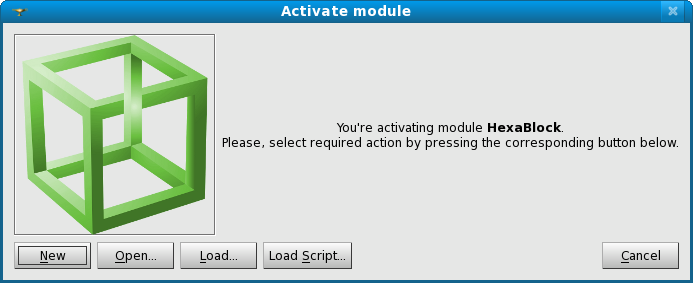

:tocdepth: 3

.. _guicomponent:

=========
Component
=========

To activate HexaBlock component, in the corresponding area of the screen:

.. image:: _static/component2.png
   :align: center

Select the HexaBlock component in the list:

.. image:: _static/component1.png
   :align: center

.. centered::
   Activate HexaBlock Component (first method)

Or click on the corresponding icon:

.. centered::
   Activate HexaBlock Component (second method)

The result of this action is:

.. centered::
   Result of the Activation of HexaBlock Component

TUI command: :ref:`tuicomponent`
