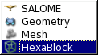

:tocdepth: 3

.. _guicomponent:

=========
Component
=========

To activate hexablock component, in the corresponding area of the
screen:

Select the hexablock component in the list:

.. centered::
   Activate Hexablock Component (first method)

Or click on the corresponding icon:

.. image:: _static/component3.png
   :align: center

.. centered::
   Activate Hexablock Component (second method)

The result of this action is:

.. image:: _static/component4.png
   :align: center

.. centered::
   Result of the Activation of Hexablock Component

TUI command: :ref:`tuicomponent`
