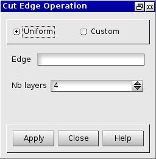
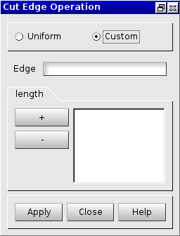

:tocdepth: 3

.. _guicuthexa:

=============
Cut hexahedra
=============

This method allows to cut in two (or more) a series of hexahedra
using a series of edges propagation.

To cut an hexahedra in the **Main Menu** select **Model -> Operation -> Cut Edge**.

.. _guicuthexauniform:

Uniform Cut
===========

The dialogue box to make a uniform cut of an hexahedra is:

.. centered::
   Uniform Cut

**Arguments:** 

- *Edge*     : an edge on the hexahedra to cut.
- *Nb layers*: the number of cuts.

TUI command: :ref:`tuicuthexauniform`

.. _guicuthexacustom:

Custom Cut
==========

The dialogue box to make a custom cut of an hexahedra is:

.. centered::
   Custom Cut

**Arguments:** 

- *Edge*     : an edge on the hexahedra to cut.
- *length*   : the list of the lengths of the layers in ascendant order.

TUI command: :ref:`tuicuthexacustom`
