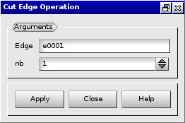

:tocdepth: 3

.. _guicuthexa:

=============
Cut hexahedra
=============

This method enables to cut in two (or more) a series of hexahedra using a series of edges propagation.
This method is very useful to connect two connexe components of hexahedra: it enables to cut a base and to make possible the use of a "merge" to accomplish this connexion.

To cut an hexaedra in the **Main Menu** select **Model -> Cut hexa** 

**Arguments:** Edge + number of cuts (nb)

The dialogue box for the cut of an hexaedra is:

.. centered::
   Cut Hexaedra

TUI command: :ref:`tuicuthexa`
