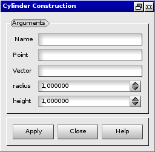

:tocdepth: 3

.. _guicylinder:

========
Cylinder
========

To create a **Cylinder** in the **Main Menu** select **Model -> Construction -> Add Cylinder**.

**Arguments:** a vertex, a vector, a radius and a height.

The dialogue box for the creation of a cylinder is:

.. centered::
   Create a Cylinder

TUI command: :ref:`tuicylinder`
