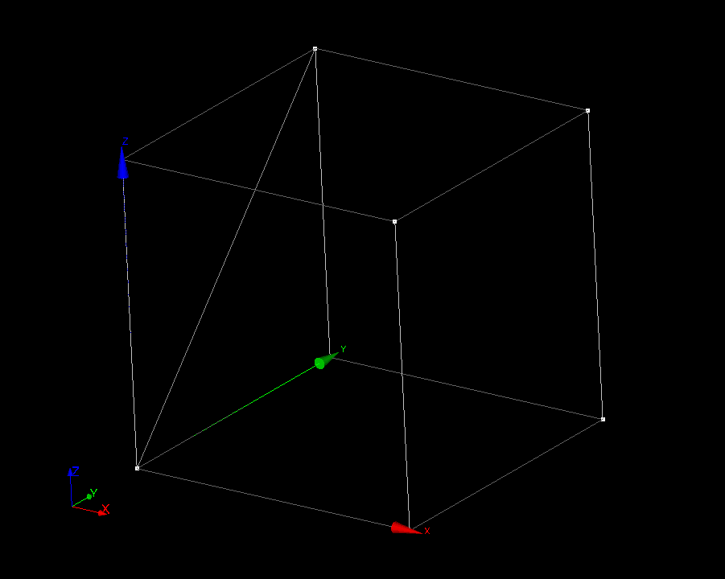
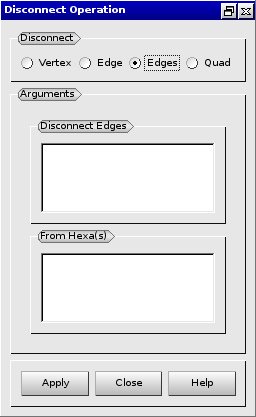
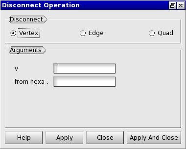

:tocdepth: 3

.. _guidisconnectelements:

===================
Disconnect elements
===================

To disconnect elements in the **Main Menu** select **Model -> Operation -> Disconnect**.

.. _guidiscoquad:

Disconnect a quadrangle
=======================

**Arguments:**

- quad: the quadrangle to disconnect.
- from hexa: the hexahedron to disconnect the quadrangle from.

The dialogue box to disconnect a quadrangle is:

.. centered::
   Disconnect a Quadrangle

Example:

.. centered::
   Disconnect a Quadrangle

.. _guidiscoedges:

Disconnect edges
==================

**Arguments:**

- edges: the edges to disconnect.
- hexas: the hexahedrons to disconnect the edges from.

The dialogue box to disconnect edges is:

.. centered::
   Disconnect Edges

.. _guidiscoedge:

Disconnect an edge
==================

**Arguments:**

- edge: the edge to disconnect.
- from hexa: the hexahedron to disconnect the edge from.

The dialogue box to disconnect an edge is:

.. centered::
   Disconnect an Edge

.. _guidiscovertex:

Disconnect a vertex
===================

**Arguments:**

- vertex: the vertex to disconnect.
- from hexa: the hexahedron to disconnect the vertex from.

The dialogue box to disconnect a vertex is:

.. centered::
   Disconnect a Vertex

TUI command: :ref:`tuidisconnectelements`
