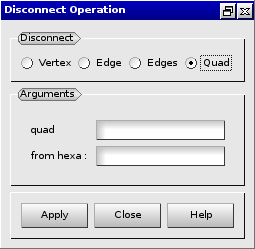
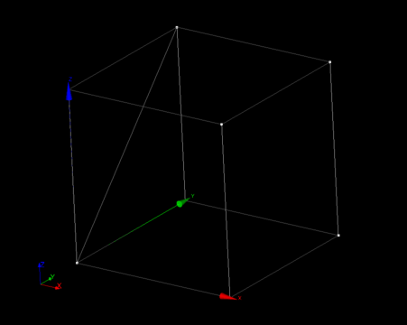

:tocdepth: 3

.. _guidisconnectelements:

===================
Disconnect elements
===================

To disconnect elements in the **Main Menu** select **Model -> Disconnect**.

.. _guidiscoquad:

Disconnect a quadrangle
=======================

**Arguments:**

- q: the quadrangle to disconnect.
- from hexa: the hexahedron to disconnect the quadrangle from.

The dialogue box to disconnect a quadrangle is:

.. centered::
   Disconnect a Quadrangle

Example:

.. centered::
   Disconnect a Quadrangle

.. _guidiscoedge:

Disconnect an edge
==================

**Arguments:**

- e: the edge to disconnect.
- from hexa: the hexahedron to disconnect the edge from.

The dialogue box to disconnect an edge is:

.. image:: _static/gui_disco_edge.png
   :align: center

.. centered::
   Disconnect an Edge

.. _guidiscovertex:

Disconnect a vertex
===================

**Arguments:**

- v: the vertex to disconnect.
- from hexa: the hexahedron to disconnect the vertex from.

The dialogue box to disconnect a vertex is:

.. centered::
   Disconnect a Vertex

TUI command: :ref:`tuidisconnectelements`
