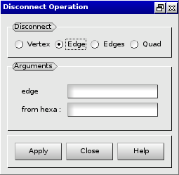

:tocdepth: 3

.. _guidisconnectelements:

===================
Disconnect elements
===================

To disconnect elements in the **Main Menu** select **Model -> Disconnect**.

.. _guidiscoquad:

Disconnect a quadrangle
=======================

**Arguments:**

- q : quadrangle to disconnect
- from hexa : hexaedron from which disconnect the quadrangle

The dialogue box to disconnect a quadrangle is:

.. image:: _static/gui_disco_quad.png
   :align: center

.. centered::
   Disconnect a Quadrangle

.. _guidiscoedge:

Disconnect an edge
==================

**Arguments:**

- e : edge to disconnect
- from hexa : hexaedron from which disconnect the edge

The dialogue box to disconnect an edge is:

.. centered::
   Disconnect an Edge

.. _guidiscovertex:

Disconnect a vertex
===================

**Arguments:**

- v : vertex to disconnect
- from hexa : hexaedron from which disconnect the vertex

The dialogue box to disconnect a vertex is:

.. image:: _static/gui_disco_vertex.png
   :align: center

.. centered::
   Disconnect a Vertex

TUI command: :ref:`tuidisconnectelements`
