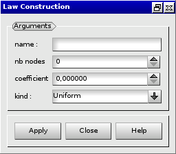

:tocdepth: 3

.. _guidiscretelaw:

==========================
Manage discretization laws
==========================

.. _guiaddlaw:

Add law
=======

A discretization law is defined by four properties:

- the name of the law
- the number of nodes for the discretization law
- the coefficient for the arithmetic and geometric law
- the kind of the law 
	- uniform
	- arithmetic
	- geometric

To define a discretization law in the **Main Menu** select **Mesh ->
Add law**.

The dialogue box for creating a law is:

.. centered::
   Add a Discretization Law

Remove law
==========

To remove a discretization law in the **Main Menu** select **Mesh ->
Remove law**.

*todo copie d'ecran*

.. image:: _static/gui_remove_law.png
   :align: center

.. centered::
   Remove law

TUI command: :ref:`tuidiscretelaw`
