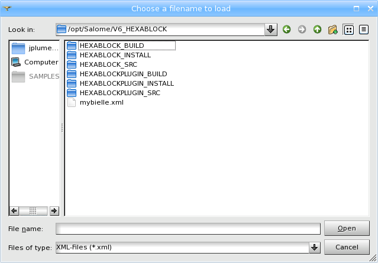
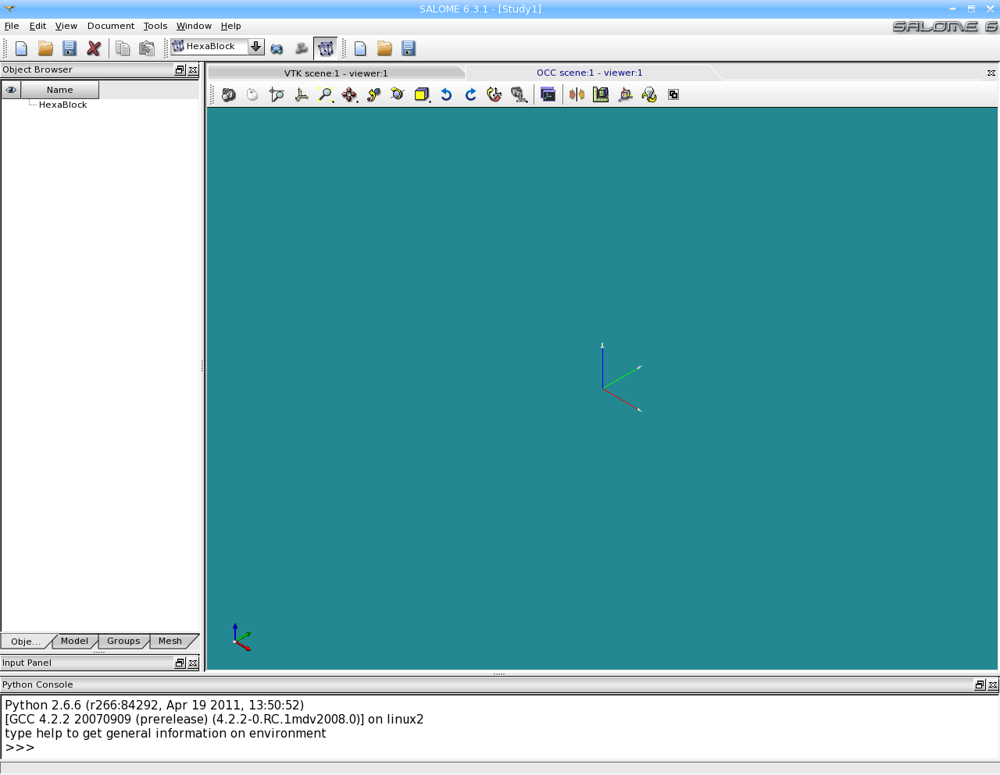

:tocdepth: 3

.. _guidocument:

========
Document
========

To create a new document in the **Main Menu** select **Document -> New Document**.

To load a document in the **Main Menu** select **Document -> Load Document**.

To save a document in the **Main Menu** select **Document -> Save Document**.

A document contains all the information to generate a hexahedral mesh:

- the model of blocks,
- all associations,
- all groups,
- all laws set on propagations.

The dialogue box to load a document is:

.. centered::
   Import Document

The result of this action is:

.. centered::
   New Document

TUI command: :ref:`tuidocument`
