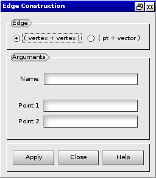
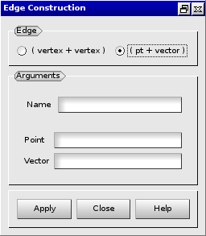

:tocdepth: 3

.. _guiedge:

====
Edge
====

To create an **Edge** in the **Main Menu** select **Model -> Construction -> Add Edge**.

There are two algorithms to create an **Edge**.

Firstly you can define an **Edge** through **Point1** and **Point2**,
which ares the points through which the **Edge** passes.

**Arguments:** 2 vertices.

The dialogue box to create an edge from vertices is:

.. centered::
   Add Edge from vertices

Secondly you can define an **Edge** through **Point** and **Vector**.

**Arguments:** a vertex and a vector.

The dialogue box to create an edge from a vertex and a vector is:

.. centered::
   Add Edge from a vertex and a vector

TUI command: :ref:`tuiedge`
