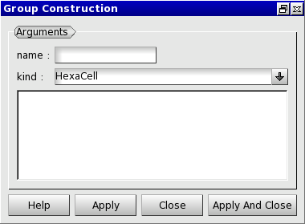

:tocdepth: 3

.. _guigroups:

==========================
Manage groups on the model
==========================

.. _guiaddgroup:

Add group
=========

A group is characterized by:

- its name,
- its type:
      - HexaCell (default)
      - EdgeCell
      - QuadCell
      - HexaNode
      - QuadNode
      - EdgeNode
      - VertexNode
- its elements.

To define groups on the model in the **Main Menu** select **Groups -> Add Group**.

.. centered::
   Add group

Remove group
============

To remove a group from the model in the **Main Menu** select **Groups -> Remove Group**.

*TODO copie d'ecran : plantage de Salome a l'ouverture de la fenetre*

.. image:: _static/gui_remove_group.png
   :align: center

.. centered::
   Remove group

TUI command: :ref:`tuigroups`
