:tocdepth: 3

.. _guihemisphere:

=========================
Create Hemispherical Grid
=========================

To create an **Hemispherical Grid** in the **Main Menu** select **Model -> Construction -> Make Hemisphere**.

.. _guisphereandrindsimple:

Simple Sphere and Simple Rind
=============================

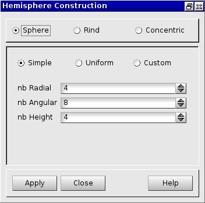

.. centered::
      Parameters for a Simple Sphere or Rind

The following data are required:

- *nb Radial*  : number of hexahedra on radial.
- *nb Angular* : number of hexahedra along the perimeter of the sphere.
- *nb Height*  : number of hexahedra along the axis of the sphere.
    
The result of this action is:

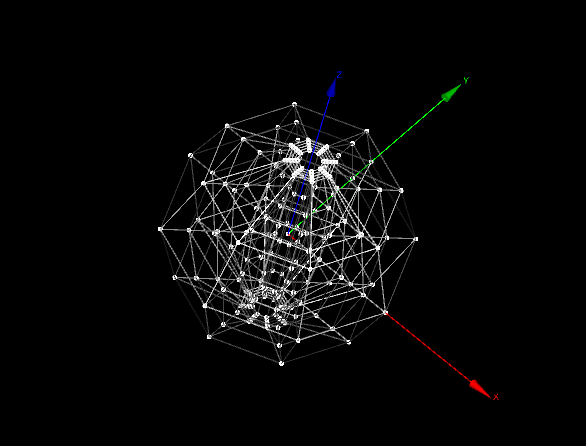

.. centered::
      Simple Sphere

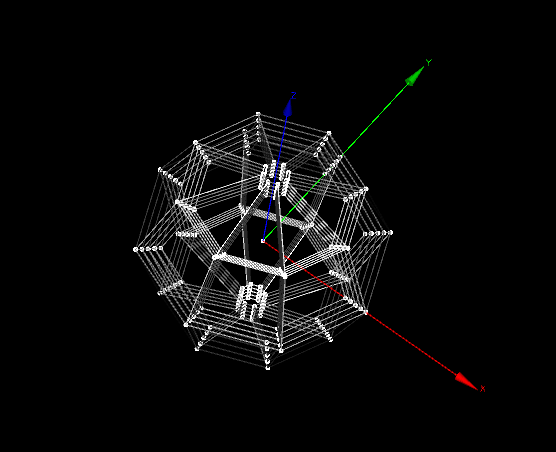

.. centered::
      Simple Rind

TUI command: :ref:`tuispheresimple`

TUI command: :ref:`tuirindsimple`

.. _guisphereuniform:

Uniform Sphere
==============

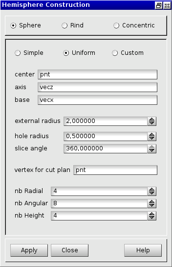

.. centered::
      Parameters for an Uniform Sphere

The following data are required:

- *center* 	   : center coordinates of the sphere (select a vertex).
- *axis*	   : the axis of the hole (select a vector).
- *base*       : the base of the sphere (select a vector).
- *external radius*: the radius of the sphere.
- *hole radius*: the radius of the hole in the sphere .
- *slice angle*: angle of the sphere around the Z axis.
- *vertex for cut plan*: the vertex along the vertical axis where the rind will be cut.
- *nb Radial*  : number of hexahedra on radial.
- *nb Angular* : number of hexahedra along the perimeter of the sphere.
- *nb Height*  : number of hexahedra along the axis of the sphere.
    
The result of this action is:

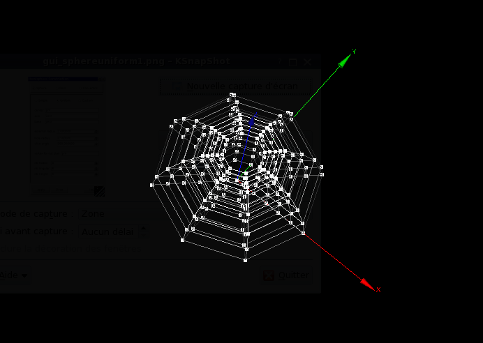

.. centered::
      Uniform Sphere

TUI command: :ref:`tuisphereuniform`

.. _guispherecustom:

Custom Sphere
=============

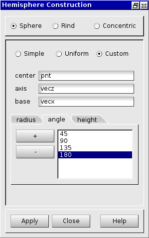

.. centered::
      Parameters for a Custom Sphere

The following data are required:

- *center*: center coordinates of the sphere (select a vertex).
- *axis*  : the axis of the hole (select a vector).
- *base*  : the base of the sphere (select a vector).
- *radius*: a list of radiuses in ascendant order.
- *angle* : a list of angles in ascendant order. 
- *height*: a list of heights in ascendant order.
    
The result of this action is:

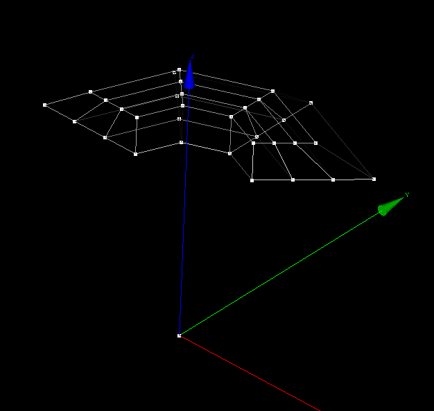

.. centered::
      Custom Sphere

TUI command: :ref:`tuispherecustom`

.. _guirinduniform:

Uniform Rind
============

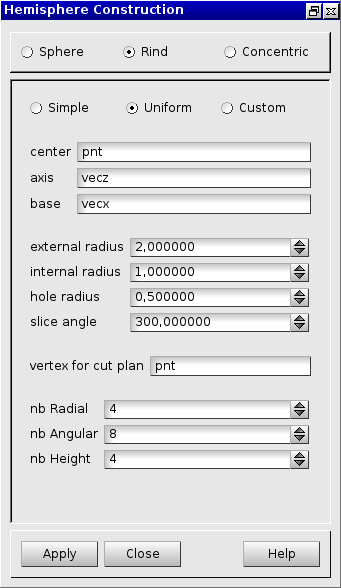

.. centered::
      Parameters for a Uniform Rind
      
The following data are required:

- *center* 	   : center coordinates of the rind (select a vertex).
- *axis*	   : the vertical axis of the rind (select a vector).
- *base*       : the base of the rind (select a vector).
- *external radius*: the radius of the rind.
- *internal radius*: the internal radius.
- *hole radius*: the radius of the hole.
- *slice angle*: angle of the rind around the Z axis.
- *vertex for cut plan*: the vertex along the vertical axis where the rind will be cut.
- *nb Radial*  : number of hexahedra on radial.
- *nb Angular* : number of hexahedra along the perimeter.
- *nb Height*  : number of hexahedra along the axis of the rind.
    
The result of this action is:

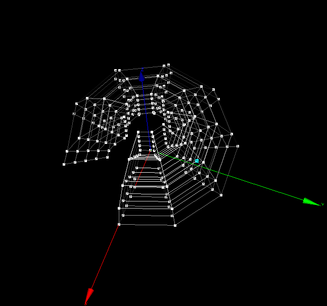

.. centered::
      Uniform Rind

TUI command: :ref:`tuirinduniform`

.. _guirindcustom:

Custom Rind
===========

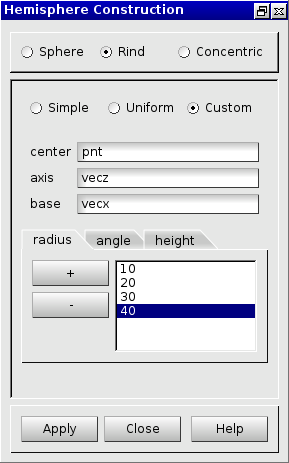

.. centered::
      Parameters for a Custom Rind
      
The following data are required:

- *center*: center coordinates of the rind (select a vertex).
- *axis*  : the vertical axis (select a vector).
- *base*  : the base of the rind (select a vector).
- *radius*: a list of radiuses in ascendant order.
- *angle* : a list of angles in ascendant order. 
- *height*: a list of heights in ascendant order.

    
The result of this action is:

.. image:: _static/rindcustom.png
   :align: center

.. centered::
      Custom Rind

TUI command: :ref:`tuirindcustom`

.. _guiconcentricsimple:

Simple Concentric (Spherical)
=============================

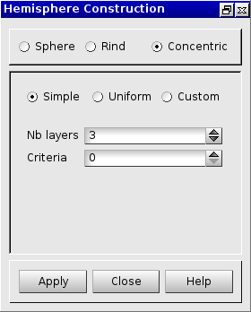

.. centered::
      Parameters for a Simple Concentric

The following data are required:

- *nb Layers*: the number of nested hexahedra.
- *Criteria*
    
The result of this action is:

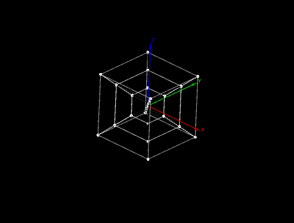

.. centered::
      Simple Concentric

TUI command: :ref:`tuiconcentricsimple`

.. _guiconcentricuniform:

Uniform Concentric (Spherical)
==============================

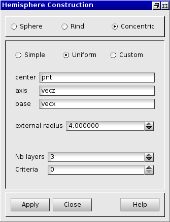

.. centered::
      Parameters for a Uniform Concentric

The following data are required:

- *center*: the center's coordinates (select a vertex).
- *axis*  : the vertical axis (select a vector).
- *base*  : the base of the concentric (select a vector).
- *external radius*: the radius of the concentric.
- *nb Layers*: the number of nested hexahedra in the concentric.
- *Criteria*.

TUI command: :ref:`tuiconcentricuniform`

.. _guiconcentriccustom:

Custom Concentric (Spherical)
=============================

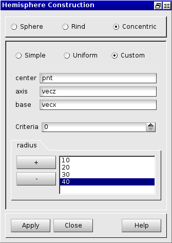

.. centered::
      Parameters for a Custom Concentric
      
The following data are required:

- *center*: the center's coordinates (select a vertex).
- *axis*  : the vertical axis (select a vector).
- *base*  : the base of the concentric (select a vector).
- *criteria*.
- *radius*: a list of radiuses in ascendant order.
    
The result of this action is:

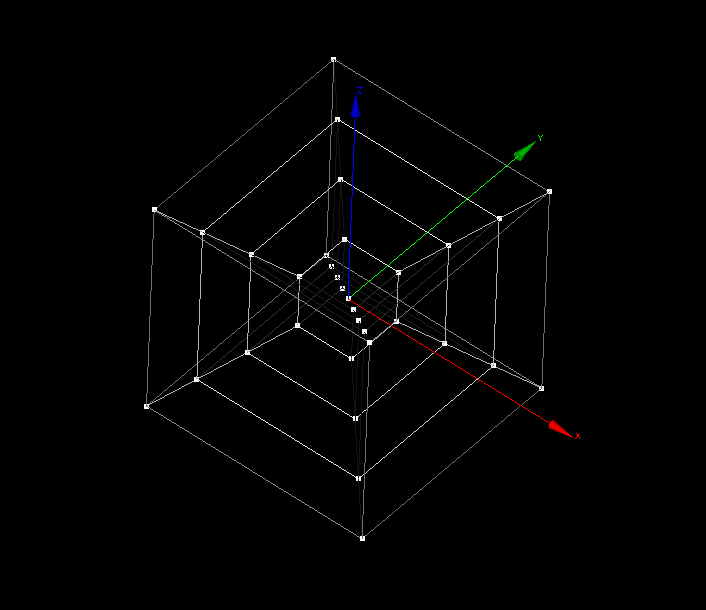

.. centered::
      Custom Concentric

TUI command: :ref:`tuiconcentriccustom`
