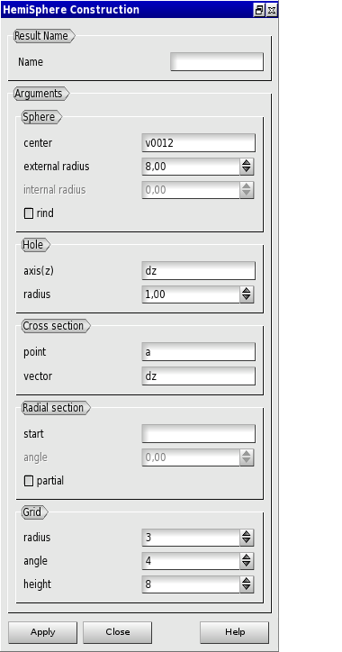
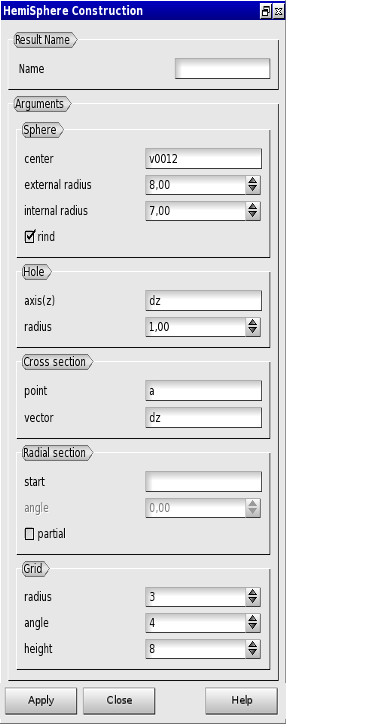
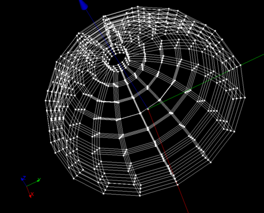
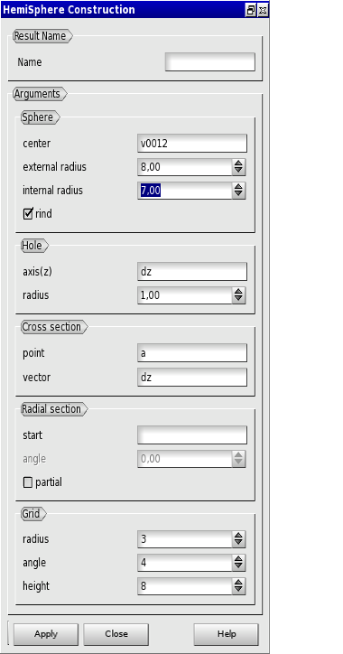

:tocdepth: 3

.. _guihemisphere:

==========
Create HemiSpherical Grid
==========

To create an **HemiSpherical Grid** in the **Main Menu** select **Model -> Make hemisphere**

.. image:: _static/gui_hemispherical.png
   :align: center

.. centered::
      Dialog Box for an hemispherical grid

The following data are required:

- Result Name
	- name            : name of the grid created ( **optionnal** )

- Sphere
	- center          : center coordinates of the sphere ( select a vertex )
	- external radius : radius size of the sphere
	- internal radius : fill this field to create rind ( **optionnal**  )

- Hole
	- axis(z) : axes of the hole ( select a vector )
	- radius  : radius size of the hole

- Partition
	- plan(pt)   : horizontal cut plan definition, coordinates of a point on it ( select a vertex )
	- plan(vect) : horizontal cut plan definition ( select a vector )
        - angle      : fill this field to make vertical cut ( value in degree , **optionnal** )

- Grid
	- radius  : number of hexa from center of the sphere
	- angle   : number of hexa along the perimeter of the sphere
	- height  : number of hexa on height of the sphere

From this dialog box, four kinds of grid can be created:

- hemispherical grid (see :ref:`guihemisphericalgrid`)
- partial hemisphericalgrid (see :ref:`guiparthemisphericalgrid`)
- rind grid (see :ref:`guirindgrid`)
- partial rind grid (see :ref:`guipartrindgrid`)

.. _guihemisphericalgrid:

HemiSpherical Grid
==============

This is the default kind of grid when no optional values are filled.

.. centered::
   An hemispherical grid

TUI command: :ref:`tuihemisphericalgrid`

.. _guiparthemisphericalgrid:

Partial HemiSpherical Grid
==============
To create a partial hemispherical grid, fill in the *angle* value by checking the *partial* checkbox:

.. centered::
      Make a partial hemispherical grid

The result:

.. image:: _static/parthemisphericalgrid.png
   :align: center

.. centered::
   A partial hemispherical grid

TUI command: :ref:`tuiparthemisphericalgrid`

.. _guirindgrid:

Rind Grid
==============
To create a rind grid, fill in the *internal radius* value by checking the *rind* checkbox:

.. centered::
      Make a rind grid

The result:

.. centered::
   A rind grid

TUI command: :ref:`tuirindgrid`

.. _guipartrindgrid:

Partial Rind Grid
==============
To create a partial rind grid, in addition to the *internal radius* value (see :ref:`guirindgrid`), fill in the *angle* value by checking the *partial* checkbox:

.. centered::
      Make a partial rind grid

The result:

.. centered::
   A partial rind grid

TUI command: :ref:`tuipartrindgrid`

