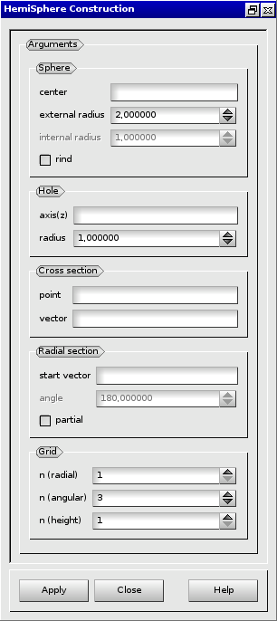

:tocdepth: 3

.. _guihemisphere:

=========================
Create HemiSpherical Grid
=========================

To create an **HemiSpherical Grid** in the **Main Menu** select **Model -> Construction -> Make Hemisphere**.

.. centered::
      Dialog Box for an hemispherical grid

The following data are required:

- Sphere
    - center: center coordinates of the sphere (select a vertex).
    - external radius: radius size of the sphere.
    - internal radius: fill this field to create rind (**optional**).

- Hole
    - axis(z): axes of the hole (select a vector).
    - radius: radius size of the hole.

- Cross section
    - point: coordinates of a point on the surface of the cross section (select a vertex).
    - vector: normal vector to the surface of the cross section (select a vector).

- Radial section
    - start   : a vector defining the start of the radial section (select a vector).
    - angle   : fill this field to customize the section (value in degree, **optional**).

- Grid
    - n (radial)  : number of hexahedra from the center of the sphere.
    - n (anglular): number of hexahedra along the perimeter of the sphere.
    - n (height)  : number of hexahedra on the height of the sphere.

From this dialog box, four kinds of grid can be created:

- hemispherical grid (see :ref:`guihemisphericalgrid`),
- partial hemisphericalgrid (see :ref:`guiparthemisphericalgrid`),
- rind grid (see :ref:`guirindgrid`),
- partial rind grid (see :ref:`guipartrindgrid`).

.. _guihemisphericalgrid:

HemiSpherical Grid
==================

This is the default kind of grid when no optional values are filled.

.. image:: _static/hemisphericalgrid.png
   :align: center

.. centered::
   An hemispherical grid

TUI command: :ref:`tuihemisphericalgrid`

.. _guiparthemisphericalgrid:

Partial HemiSpherical Grid
==========================

To create a partial hemispherical grid: On *Radial section* check the *partial* check box and fill in the *angle* parameter.

.. centered::
   A partial hemispherical grid

TUI command: :ref:`tuiparthemisphericalgrid`

.. _guirindgrid:

Rind Grid
==========

To create a rind grid: On *Sphere* check the *rind* check box and fill in the *internal radius* parameter.

.. image:: _static/rindgrid.png
   :align: center

.. centered::
   A rind grid

TUI command: :ref:`tuirindgrid`

.. _guipartrindgrid:

Partial Rind Grid
=================

To create a partial rind grid: in addition to the *internal radius* parameter 
(see :ref:`guirindgrid`), on *Radial section* check the *partial* check box and fill
in the *angle* parameter.

.. image:: _static/partrindgrid.png
   :align: center

.. centered::
   A partial rind grid

TUI command: :ref:`tuipartrindgrid`

