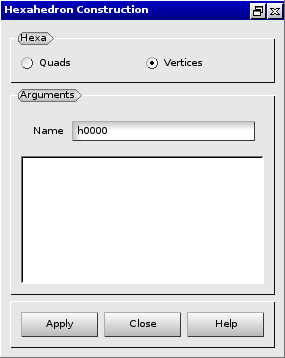

:tocdepth: 3

.. _guihexahedron:

==========
Hexahedron
==========

To create an **Hexahedron** in the **Main Menu** select **Model -> Construction -> Add Hexahedron**.

There are two methods to create an **Hexahedron**.

Create from quadrangles
=======================
The **Hexahedron** can be defined its faces (quadrangles).

**Arguments:** Select from 2 to 6 quadrangles.

The dialogue box to create an hexahedron from quadrangles is:

.. image:: _static/gui_hexa_quads.png
   :align: center

.. centered::
   Create an Hexahedron from quadrangles

Create from vertices
====================
The **Hexahedron** can also be defined by its vertices **Vertex 1**,
**Vertex 2**, ..., **Vertex 8**.

**Arguments:** Select 8 vertices.

The dialogue box to create an hexahedron from vertices is:

.. centered::
   Create an Hexahedron from vertices

TUI command: :ref:`tuihexahedron`

About hexahedron: :ref:`annexe`
