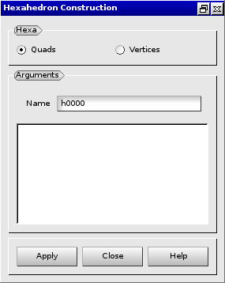

:tocdepth: 3

.. _guihexahedron:

==========
Hexahedron
==========

To create an **Hexaedron** in the **Main Menu** select **Model -> Add hexa** 

There are 2 ways to create an **Hexaedron** :

Firstly you can define an **Hexaedron** by 2,3,4,5 or 6 Quads 

**Arguments:**  Select from 2 to 6 quadrangles

The dialogue box for the creation of an hexahedron from quads is:

.. centered::
   Create an Hexahedron from quads

Secondly you can define an **Hexaedron** through **Vertex 1**, **Vertex
2**, **Vertex 3**, **Vertex 4**, **Vertex 5**, **Vertex 6**, **Vertex
7**, and **Vertex 8**, which ares the points through wich the **Hexaedron** passes.

**Arguments:** Select 8 vertices

The dialogue box for the creation of an hexahedron from vertices is:

.. image:: _static/gui_hexa_vertices.png
   :align: center

.. centered::
   Create an Hexahedron from vertices

TUI command: :ref:`tuihexahedron`

About hexahedron: :ref:`annexe`
