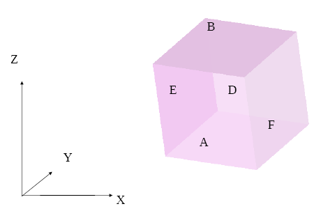

:tocdepth: 3

.. _guihexahedron:

==========
Hexahedron
==========

To create an **Hexaedron** in the **Main Menu** select **Model -> Add hexa** 

There are 2 ways to create an **Hexaedron** :

Firstly you can define an **Hexaedron** by 2,3,4,5 or 6 Quads 

**Arguments:**  Select from 2 to 6 quadrangles

The dialogue box for the creation of an hexahedron from quads is:

.. image:: _static/gui_hexa_quads.png
   :align: center

.. centered::
   Create an Hexahedron from quads

Secondly you can define an **Hexaedron** through **Vertex 1**, **Vertex
2**, **Vertex 3**, **Vertex 4**, **Vertex 5**, **Vertex 6**, **Vertex
7**, and **Vertex 8**, which ares the points through wich the **Hexaedron** passes.

**Arguments:** Select 8 vertices

The dialogue box for the creation of an hexahedron from vertices is:

.. image:: _static/gui_hexa_vertices.png
   :align: center

.. centered::
   Create an Hexahedron from vertices

TUI command: :ref:`tuihexahedron`

A: plane Z = 0

B: plane Z = 1

C: plane Y = 0

D: plane Y = 1

E: plane X = 0

F: plane X = 1

Quadrangles in an hexahedron
''''''''''''''''''''''''''''''

Where are the 6 quadrangles in an hexahedron ?

Q_A or 0: plane Z=0

Q_B or 1: plane Z=1

Q_C or 2: plane Y=0

Q_D or 3: plane Y=1

Q_E or 4: plane X=0

Q_F or 5: plane X=1

Edges in an hexahedron
''''''''''''''''''''''''

Where are the 12 edges in an hexahedron ?

 E_AC or 0: planes Z=0 and Y=0

 E_AD or 1: planes Z=0 and Y=1

 E_BC or 2: planes Z=1 and Y=0

 E_BD or 3: planes Z=1 and Y=1

 E_AE or 4: planes Z=0 and X=0

 E_AF or 5: planes Z=0 and X=1

 E_BE or 6: planes Z=1 and X=0

 E_BF or 7: planes Z=1 and X=1

 E_CE or 8: planes Y=0 and X=0

 E_CF or 9: planes Y=0 and X=1

 E_DE or 10: planes Y=1 and X=0

 E_DF or 11: planes Y=1 and X=1

Vertices in an hexahedron
''''''''''''''''''''''''''''

Where are the 8 vertices in an hexahedron ?

 V_ACE or 0: planes Z=0 and Y=0 and X=0

 V_ACF or 1: planes Z=0 and Y=0 and X=1

 V_ADE or 2: planes Z=0 and Y=1 and X=0

 V_ADF or 3: planes Z=0 and Y=1 and X=1

 V_BCE or 4: planes Z=1 and Y=0 and X=0

 V_BCF or 5: planes Z=1 and Y=0 and X=1

 V_BDE or 6: planes Z=1 and Y=1 and X=0

 V_BDF or 7: planes Z=1 and Y=1 and X=1

