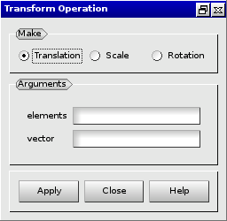
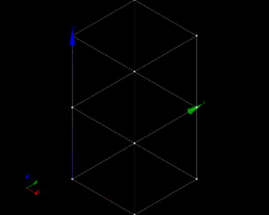
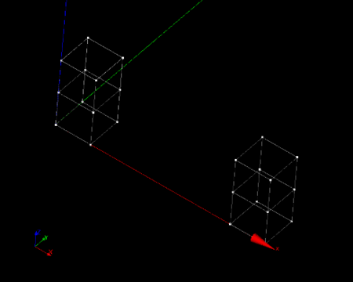
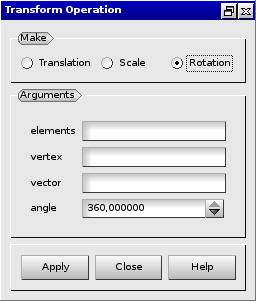
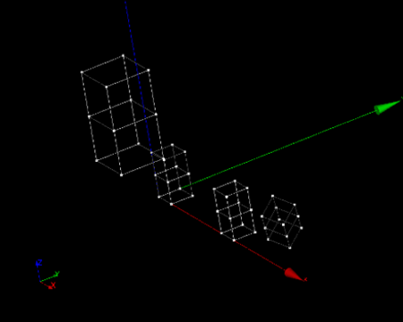

:tocdepth: 3

.. _guimakeelements:

======================================
Make elements by transforming elements
======================================

To make elements by transforming elements in the **Main Menu** select
**Model -> Operation -> Make transformation**.

.. _guimaketranslation:

Make elements by translation
============================

**Arguments:**

- elements to translate,
- vector.

The dialogue box to make elements by translation is:

.. centered::
   Make Elements by Translation

Example:

.. centered::
   Before Transforming 

.. centered::
   Make Translation

.. _guimakescaling:

Make elements by scaling
========================

**Arguments:**

- elements,
- vertex,
- k growing factor.

The dialogue box to make elements by scaling is:

.. image:: _static/gui_make_transfo_scale.png
   :align: center

.. centered::
   Make Elements by Scaling

Example:

.. centered::
   Make Elements by Scaling

.. _guimakerotation:

Make elements by rotation
=========================

**Arguments:**

- elements,
- vertex,
- vector direction,
- angle.

The dialogue box to make elements by rotation is:

.. centered::
   Make Elements by Rotation

Example:

.. centered::
   Make Rotation

TUI command: :ref:`tuimakeelements`
