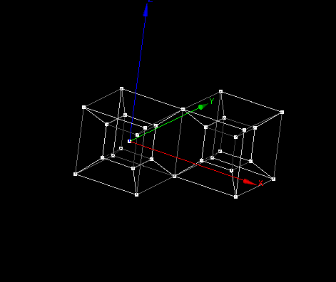

:tocdepth: 3

.. _guimakesymmetry:

=========================
Make elements by symmetry
=========================

To make elements by symmetry elements in the **Main Menu** select
**Model -> Operation -> Make symmetry**.

.. _guimakepoint:

Make elements by point symmetry
===============================

**Arguments:**

- elements,
- vertex.

The dialogue box to make elements by point symmetry is:

.. image:: _static/gui_make_point_symmetry.png
   :align: center

.. centered::
   Make Elements by point symmetry
   
Example
-------

.. centered::
   Spherical grid

A point symmetry on the *Spherical grid* gives the following result:

.. centered::
   Point symmetry on *Spherical grid*
   
   
.. _guimakeline:

Make elements by line symmetry
==============================

**Arguments:**

- elements,
- vertex,
- vector.

The dialogue box to make elements by line symmetry is:

.. image:: _static/gui_make_line_symmetry.png
   :align: center

.. centered::
   Make Elements by Line Symmetry

Example
-------
   
A line symmetry on the *Spherical grid* gives the following result:

.. centered::
   Line symmetry on *Spherical grid*
   

.. _guimakeplan:

Make elements by plane symmetry
===============================

**Arguments:**

- elements,
- vertex,
- vector.

The dialogue box to make elements by plane symmetry is:

.. image:: _static/gui_make_plan_symmetry.png
   :align: center

.. centered::
   Make Elements by Plane Symmetry
   
   
Example
-------
   
A plane symmetry on the *Spherical grid* gives the following result:

.. centered::
   Plane symmetry on *Spherical grid*
   
   
TUI command: :ref:`tuimakesymmetry`
