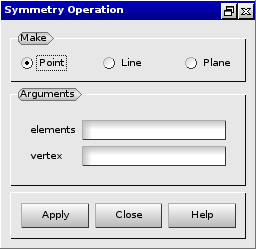
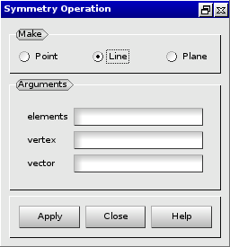

:tocdepth: 3

.. _guimakesymmetry:

=========================
Make elements by symmetry
=========================

To make elements by symmetry elements in the **Main Menu** select
**Model -> Make symmetry**.

.. _guimakepoint:

Make elements by point symmetry
===============================

**Arguments:**

- elements,
- vertex.

The dialogue box to make elements by point symmetry is:

.. centered::
   Make Elements by point symmetry

.. _guimakeline:

Make elements by line symmetry
==============================

**Arguments:**

- elements,
- vertex,
- vector.

The dialogue box to make elements by line symmetry is:

.. centered::
   Make Elements by Line Symmetry

.. _guimakeplan:

Make elements by plan symmetry
==============================

**Arguments:**

- elements,
- vertex,
- vector.

The dialogue box to make elements by plan symmetry is:

.. image:: _static/gui_make_plan_symmetry.png
   :align: center

.. centered::
   Make Elements by Plan Symmetry

