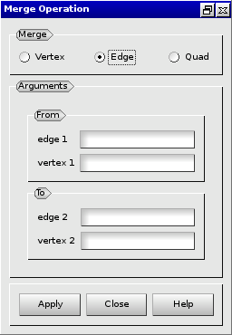

:tocdepth: 3

.. _guimergeelements:

============== 
Merge elements
==============

To merge elements in the **Main Menu** select **Model -> Merge**.

.. _guimergequads:

Merge two quadrangles
=====================

**Arguments:**

- 2 quadrangles (q1 and q2),
- 4 vertices (v1, v2, v3, v4).

v1: vertex of the quadrangle *q1* to merge with the vertex *v2* of the quadrangle *q2*.
v3: vertex of the quadrangle *q1* to merge with the vertex *v4* of the quadrangle *q2*.

The dialogue box to merge two quadrangles is:

.. image:: _static/gui_merge_quads.png
   :align: center

.. centered::
   Merge two Quadrangles

.. _guimergeedges:

Merge two edges
===============

**Arguments:**

- 2 edges (e1 and e2),
- 2 vertices (v1 and v2).

v1: vertex of the edge *e1* to merge with the vertex *v2* of the edge *e2*.

The dialogue box to merge two edges is:

.. centered::
   Merge two Edges

.. _guimergevertices:

Merge two vertices
==================

**Arguments:** 2 vertices (v1 and v2).

The dialogue box to merge two vertices is:

.. image:: _static/gui_merge_vertices.png
   :align: center

.. centered::
   Merge two Vertices

TUI command: :ref:`tuimergeelements`
