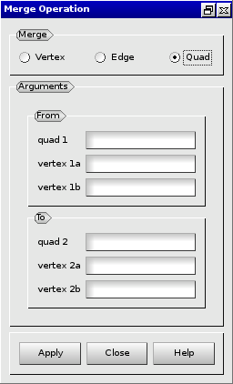
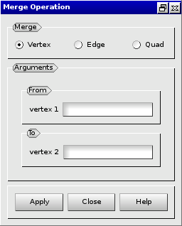

:tocdepth: 3

.. _guimergeelements:

============== 
Merge elements
==============

To merge elements in the **Main Menu** select **Model -> Operation -> Merge**.

.. _guimergequads:

Merge two quadrangles
=====================

**Arguments:**

- 2 quadrangles (quad 1 and quad 2),
- 4 vertices (vertex 1a, vertex 2a, vertex 1b, vertex 2b).

vertex 1a: vertex of the quadrangle *quad 1* to merge with the vertex *vertex 2a* of the quadrangle *quad 2*.

vertex 1b: vertex of the quadrangle *quad 1* to merge with the vertex *vertex 2b* of the quadrangle *quad 2*.

The dialogue box to merge two quadrangles is:

.. centered::
   Merge two Quadrangles

.. _guimergeedges:

Merge two edges
===============

**Arguments:**

- 2 edges (edge 1 and edge 2),
- 2 vertices (vertex 1 and vertex 2).

vertex 1: vertex of the edge *edge 1* to merge with the vertex *vertex 2* of the edge *edge 2*.

The dialogue box to merge two edges is:

.. image:: _static/gui_merge_edges.png
   :align: center

.. centered::
   Merge two Edges

.. _guimergevertices:

Merge two vertices
==================

**Arguments:** 2 vertices (vertex 1 and vertex 2).

The dialogue box to merge two vertices is:

.. centered::
   Merge two Vertices

TUI command: :ref:`tuimergeelements`
