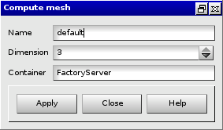

:tocdepth: 3

.. _guimesh:

=================
Generate the mesh
=================

To generate the mesh in the **Main Menu** select **Mesh -> Compute Mesh**.

**Arguments:**

- Name
- Dimension:

  - 3: to generate nodes, segments, quadrangles and hexahedral
  - 2: to generate nodes, segments and quadrangles
  - 1: to generate nodes and segments
  - 0: to generate only nodes
- Container

The dialogue box for generate the mesh is:

.. centered::
   Compute Mesh

TUI command: :ref:`tuimesh`
