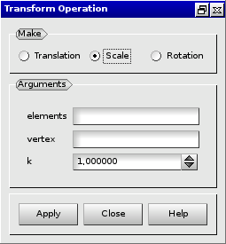
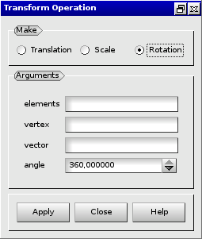

:tocdepth: 3

.. _guimodifyelements:

========================================
Modify elements by transforming elements
========================================

To modify elements by transforming elements in the **Main Menu** select
**Model -> Perform transformation**.

.. _guimodifytranslation:

Modify elements by translation
==============================

**Arguments:**

- elements
- vector *todo kesako ?*

The dialogue box to modify elements by translation is:

.. image:: _static/gui_modify_transfo_translation.png
   :align: center

.. centered::
   Modify Elements by Translation

.. _guimodifyscaling:

Modify elements by scaling
==========================

**Arguments:**

- elements
- vertex *todo kesako ?*
- k *todo kesako ?*

The dialogue box to modify elements by scaling is:

.. centered::
   Modify Elements by Scaling

.. _guimodifyrotation:

Modify elements by rotation
===========================

**Arguments:**

- elements
- vector *todo kesako ?*
- vertex *todo kesako ?*
- angle

The dialogue box to modify elements by rotation is:

.. centered::
   Modify Elements by Rotation

TUI command: :ref:`tuimodifyelements`
