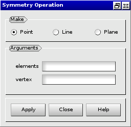
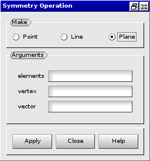

:tocdepth: 3

.. _guimodifysymmetry:

===========================
Modify elements by symmetry
===========================

To modify elements by symmetry elements in the **Main Menu** select **Model -> Operation -> Perform Symmetry**.

.. _guimodifypoint:

Modify elements by point symmetry
=================================

**Arguments:**

- elements,
- vertex.

The dialogue box to modify elements by point symmetry is:

.. centered::
   Modify Elements by Point Translation

.. _guimodifyline:

Modify elements by line symmetry
================================

**Arguments:**

- elements,
- vertex,
- vector.

The dialogue box to modify elements by line symmetry is:

.. image:: _static/gui_modify_line_symmetry.png
   :align: center

.. centered::
   Modify Elements by Line Symmetry

.. _guimodifyplan:

Modify elements by plane symmetry
=================================

**Arguments:**

- elements,
- vertex,
- vector.

The dialogue box to modify elements by plane symmetry is:

.. centered::
   Modify Elements by Plane Symmetry

 
TUI command: :ref:`tuimodifysymmetry`
