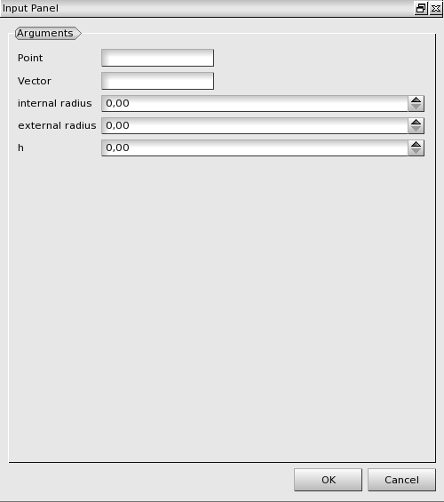

:tocdepth: 3

.. _guipipe:

====
Pipe
====

To create a **Pipe** in the **Main Menu** select **Model -> Construction -> Add Pipe**.

There is no construction of blocks.
Pipe is an intermediate object built in order to make the dialog boxes of blocks construction more concise.

**Arguments:** a vertex (base), a vector (direction), internal and external radius, and a height.

The dialogue box for the creation of a pipe is:

.. centered::
   Create a Pipe

TUI command: :ref:`tuipipe`
