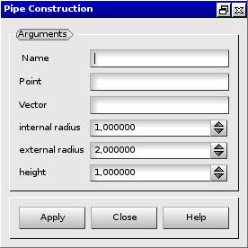

:tocdepth: 3

.. _guipipe:

====
Pipe
====

To create a **Pipe** in the **Main Menu** select **Model -> Add pipe** 

**Arguments:** 1 vertex (base) + 1 vector (direction) + internal radius + external
               radius + height (h)

The dialogue box for the creation of a pipe is:

.. centered::
   Create a Pipe

TUI command: :ref:`tuipipe`
