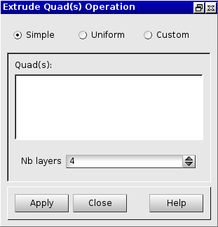
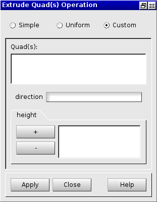
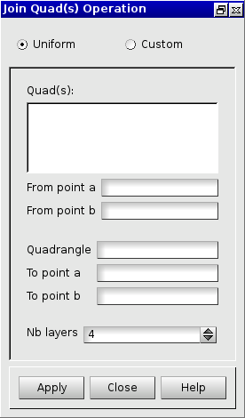
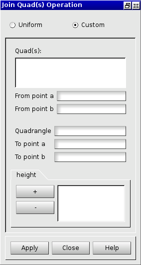

:tocdepth: 3

.. _guiextrudejoinquads:

============================ 
Extrude and join quadrangles
============================

.. _guiextrudequads:

Extrude Quadrangles
===================

To extrude from quadrangles in the **Main Menu** select **Model -> Operation -> Extrude Quadrangles**.

From a list of quadrangles, a set of hexahedra is created.

.. _guiextrudequadssimple:

Simple Extrude
--------------

The dialogue box to  make a simple extrude of quadrangles is:

.. centered::
   Simple Extrude From Quadrangles

**Arguments:** 

- *Quad(s)*   : the list of quadrangles to be extruded.
- *Nb layers* : the number of layers of hexahedra resulting from the extrusion.

The direction of the extrusion is the vertical axis (Z axis).

TUI command: :ref:`tuiextrudequadssimple`

.. _guiextrudequadsuniform:

Uniform Extrude
---------------

The dialogue box to  make a uniform extrude of quadrangles is:

.. image:: _static/gui_extrudequadsuniform.png
   :align: center

.. centered::
   Uniform Extrude From Quadrangles

**Arguments:** 

- *Quad(s)*   : the list of quadrangles to be extruded.
- *dircection*: the direction of the extrusion.
- *length*    : the length of hexahedra resulting from the extrusion.
- *Nb layers* : the number of layers of hexahedra resulting from the extrusion.

TUI command: :ref:`tuiextrudequadsuniform`

.. _guiextrudequadscustom:

Custom Extrude
--------------

The dialogue box to  make a custom extrude of quadrangles is:

.. centered::
   Custom Extrude From Quadrangles

**Arguments:** 

- *Quad(s)*   : the list of quadrangles to be extruded.
- *direction* : the direction of the extrusion.
- *height*    : a list of heights (in ascendant order because the size is computed from the origin) to specify the size of each layer of extrusion.

TUI command: :ref:`tuiextrudequadscustom`

.. _guijoinquads:

Join Quadrangles
================

To join quadrangles in the **Main Menu** select **Model -> Operation -> Join Quadrangles**.

.. _guijoinquadsuniform:

Uniform Join Quadrangles
------------------------

.. centered::
   Uniform Join Quadrangles Dialog Box

**Arguments:** 

- *Quad(s)*     : the set of quadrangles to be joined and from which hexahedra will be created.
- *From point a*: a vertex belonging to the first quadrangle of the set of quadrangles.
- *From point b*: a vertex, consecutive to previous Point a, belonging to the first quadrangle.
    
- *Quadrangle*  : a quadrangle from the set of targeted quadrangles.
- *To point a*  : the target vertex (in the target quadrangle) for *From point a*.
- *To point b*  : the target vertex (in the target quadrangle) for *From point b*.

- *Nb layers*   : number of layers of hexahedra issued from the operation.

TUI command: :ref:`tuijoinquadsuniform`

.. _guijoinquadscustom:

Custom Join Quadrangles
-----------------------

.. centered::
   Custom Join Quadrangles Dialog Box

**Arguments:** 

- *Quad(s)*     : the set of quadrangles to be joined and from which hexahedra will be created.
- *From point a*: a vertex belonging to the first quadrangle of the set of quadrangles.
- *From point b*: a vertex, consecutive to previous Point a, belonging to the first quadrangle.
    
- *Quadrangle*  : a quadrangle from the set of targeted quadrangles.
- *To point a*  : the target vertex (in the target quadrangle) for *From point a*.
- *To point b*  : the target vertex (in the target quadrangle) for *From point b*.

- *height*      : a list of heights to specify the size of each layer of hexahedra issued from the operation.

TUI command: :ref:`tuijoinquadscustom`

