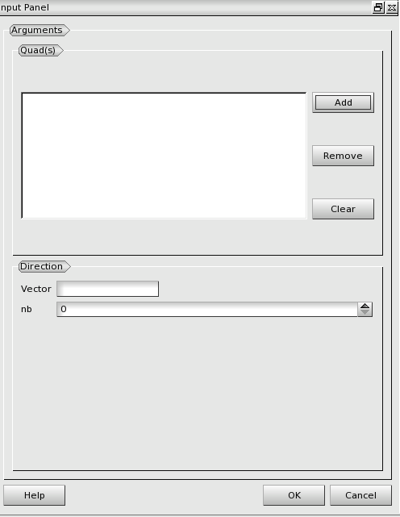
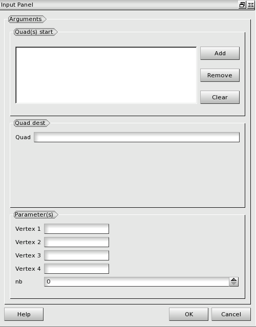

:tocdepth: 3

.. _guiprismjoinquad:

========================== 
Prism and join quadrangles
==========================

.. _prismquad:

Prism Quadrangles
=================

To prism from quadrangles in the **Main Menu** select **Model -> Prism
quad**.

*todo completer (liste des arguments, etc...)*

The dialogue box to prism from quadrangles is:

.. centered::
   Prism From Quadrangles

.. _joinquad:

Join Quadrangles
================

To join quadrangles in the **Main Menu** select **Model -> Join
quad**.

*todo completer (liste des arguments, etc...)*

The dialogue box to join 2 sets of quadrangles is:

.. centered::
   Join 2 sets of Quadrangles

TUI command: :ref:`tuiprismjoinquad`
