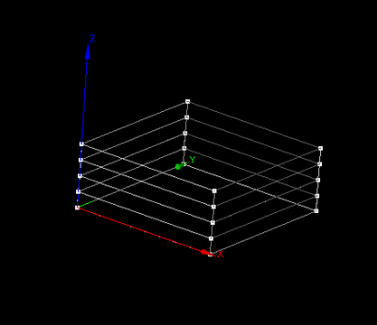

:tocdepth: 3

.. _guiprismjoinquad:

========================== 
Prism and join quadrangles
==========================

.. _prismquad:

Prism Quadrangles
=================

To prism from quadrangles in the **Main Menu** select **Model -> Operation -> Prism Quadrangles**.

From a list of quadrangles, a set of hexahedra is created.

Regular
-------

**Arguments:** 

- a list of quadrangles
- a vector (direction)
- the number of layers

The dialogue box to prism from quadrangles is:

.. image:: _static/gui_prism_quads.png
   :align: center

.. centered::
   Prism From Quadrangles

Example:

.. centered::
   Prism Quads
   

Irregular
---------

**Arguments:** 

- a list of quadrangles
- a vector (direction)
- a list of heights (a height for each layer - ascending)

The dialogue box to prism from quadrangles irregular mode is:

.. centered::
   Prism From Quadrangles (Irregular mode)

Example:

.. centered::
   Irregular Prism Quads
   
TUI command: :ref:`tuiprismquad`

.. _joinquad:

Join Quadrangles
================

To join quadrangles in the **Main Menu** select **Model -> Operation -> Join Quadrangles**.

.. image:: _static/gui_join_quads.png
   :align: center

.. centered::
   Join Quadrangles Dialog Box

The following data are required:

- From
    - Quadrangles: the set of quadrangles to be joined and from which hexahedra will be created.
    - Point a: a vertex belonging to the first quadrangle of the set of quadrangles.
    - Point b: a vertex, consecutive to previous Point a, belonging to the first quadrangle.

- To
    - Quadrangle: a quadrangle from the set of targeted quadrangles.
    - Point a: the target vertex (in the target quadrangle) for *From.Point a*.
    - Point b: the target vertex (in the target quadrangle) for *From.Point b*.

- Grid
    - size: number of layers of hexahedra issued from the operation.

TUI command: :ref:`tuijoinquad`

