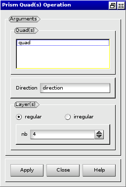

:tocdepth: 3

.. _guiprismjoinquad:

========================== 
Prism and join quadrangles
==========================

.. _prismquad:

Prism Quadrangles
=================

To prism from quadrangles in the **Main Menu** select **Model -> Prism
quad**.

From a list of quadrangles, a set of hexaedra is created.

**Arguments:** list of quadrangles + 1 vector (direction) + number of layers

The dialogue box to prism from quadrangles is:

.. centered::
   Prism From Quadrangles

Example:

.. image:: _static/prisme_gui.png
   :align: center

.. centered::
   Prism Quads

.. _joinquad:

Join Quadrangles
================

To join quadrangles in the **Main Menu** select **Model -> Join
quad**.

**Arguments:** list of quadrangles + 1 destination quad + 4 vertices +
  number of layers

The dialogue box to join 2 sets of quadrangles is:

.. image:: _static/gui_join_quads.png
   :align: center

.. centered::
   Join 2 sets of Quadrangles

TUI command: :ref:`tuiprismjoinquad`
