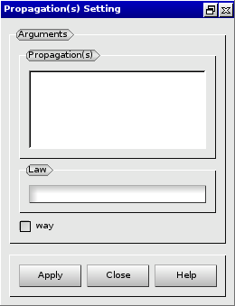

:tocdepth: 3

.. _guipropag:

===================================
Discretize on the propagation edges
===================================

To define a law for a propagation or a list of propagations in the **Main Menu** select **Mesh -> Set Propagation**.

**Arguments:** 

 - a List of propagations
 - a Law
 - direction (way)

The dialogue box for setting a law for a propagation or a list of propagations is:

.. centered::
   Setting propagations' law

TUI command: :ref:`tuipropag`
